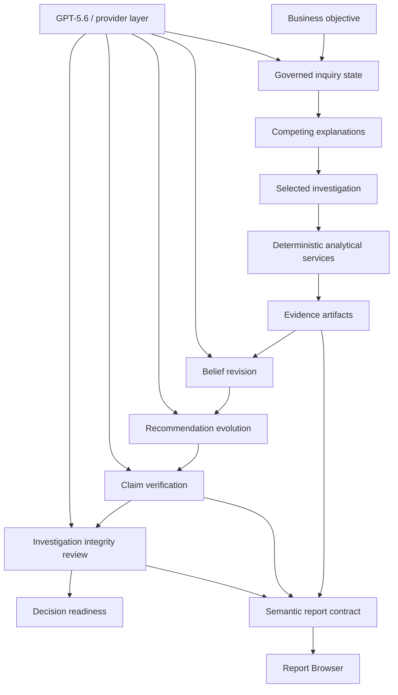

# Analytics Workstation

**Version:** `1.0.0-buildweek`

Analytics Workstation is an evidence-governed AI investigation platform.

It is built for analytical work that cannot be reduced to a dashboard, a notebook, or a one-shot AI answer. The workstation helps a user move from a business objective to a decision-ready recommendation by preserving the investigation itself: what was observed, what was uncertain, which explanations competed, what evidence was gathered, how beliefs changed, which claims were verified, and why the final recommendation deserves trust.

The central idea is simple:

> Analytics Workstation does not just produce answers. It conducts transparent investigations that can revise their conclusions as evidence accumulates, then critique their own recommendations before asking for trust.

## Why This Project Took This Shape

Analytics Workstation is also a record of an AI-assisted development experiment.

As implementation became dramatically cheaper, the project did not spend all of that savings on adding more disconnected features. It reinvested much of it into harder questions about evidence, governance, representation, trust, product experience, and architectural coherence.

The result is unusually comprehensive because the work repeatedly asked: if this principle is true, what else follows?

For the full technical history, see `docs/development_ordeal.md`.

## The Problem

Most analytics systems are optimized for outputs.

They generate dashboards. They generate reports. They generate model summaries. Newer systems generate AI explanations on top of those outputs.

Experienced analysts do something different. They investigate.

They notice an anomaly. They form competing explanations. They gather evidence. They revise beliefs. They reject tempting conclusions. They communicate uncertainty. They decide whether the available evidence is strong enough to act.

That reasoning path is often scattered across dashboards, notebooks, slide decks, chat transcripts, model artifacts, and memory. When a recommendation becomes important, the hardest questions are not always technical:

- Why did we reach this conclusion?
- What evidence supports it?
- What evidence weakens it?
- Which explanations were rejected?
- What assumptions are still carrying the recommendation?
- Would more analysis likely change the decision?

Analytics Workstation models that workflow directly.

## The Investigation Loop

```text
Objective
  |
  v
Observation
  |
  v
Competing Explanations
  |
  v
Investigation
  |
  v
Evidence
  |
  v
Belief Revision
  |
  v
Recommendation Evolution
  |
  v
Claim Verification
  |
  v
Integrity Review
  |
  v
Decision Readiness
```

The workstation treats evidence as a first-class product object. Reports, visualizations, AI summaries, and recommendations are different ways to communicate that evidence. They are not substitutes for the investigation.

## Why Analytics Workstation Is Different

| Traditional analytics | LLM dashboards | Analytics Workstation |
|---|---|---|
| Shows metrics and outputs | Adds natural-language summaries | Preserves the investigation path |
| Often hides rejected explanations | May explain whatever context is pasted in | Tracks competing explanations explicitly |
| Produces static recommendations | Produces fluent answers | Revises recommendations as evidence changes |
| Separates reports from evidence | Summarizes artifacts after the fact | Links claims back to evidence |
| Leaves trust to the presenter | Can sound confident without proof | Performs skeptical integrity review before action |

The product is not trying to make analytics feel magical. It is trying to make analytical reasoning visible, governed, and reusable.

## Build Week Demonstration

The Build Week demo is a focused investigation over a deterministic synthetic enrollment-growth dataset.

The investigation begins with a plausible but incomplete belief: a marketing channel appears inefficient and may deserve budget cuts. The workstation does not stop there. It compares competing explanations, gathers deterministic evidence, revises the belief, and evolves the recommendation.

By the end, the recommendation is more specific and more defensible:

- improve operational throughput before cutting demand generation;
- refresh aging creative where fatigue is visible;
- tune saturated Search spend rather than broadly reducing it;
- account for competitor pressure separately from channel quality;
- preserve unresolved uncertainty instead of hiding it.

The most important moment is not that the system gives an answer. The important moment is that the system can answer:

> Why should I believe this?

It shows the initial belief, evidence discovered, belief revisions, final claim, diagnostics, methodology, limitations, contradictory evidence, assumptions, integrity review, and decision readiness.

## What GPT-5.6 Does

GPT-5.6 is used where probabilistic reasoning is useful:

- investigation framing;
- semantic synthesis;
- belief-evolution narrative;
- recommendation evolution;
- claim verification;
- integrity-review explanation.

It is not used to invent evidence or replace deterministic analytics.

Deterministic services remain responsible for:

- synthetic demo data generation;
- EDA;
- regression diagnostics;
- SHAP evidence;
- validation;
- replay;
- report-contract construction;
- QA.

This separation is deliberate. Deterministic knowledge should be computed deterministically. Probabilistic reasoning should be reserved for ambiguity, synthesis, judgment, and explanation.

## How Codex Was Used

Codex accelerated the implementation of a large, coherent product system.

It helped build:

- provider-agnostic GenAI services;
- governed agent sessions;
- inquiry state;
- belief revision;
- recommendation evolution;
- claim verification;
- investigation integrity review;
- semantic report contracts;
- UI refinement;
- deterministic QA;
- documentation and submission materials.

Codex was used as an engineering collaborator, not as a replacement for product direction. The architecture remained intentional: evidence first, governed AI operation, deterministic computation, traceable claims, and explicit uncertainty.

## Architecture At A Glance



The AI operates through bounded provider, context, and action contracts. It does not receive arbitrary permission to mutate the project. When provider setup is missing, the workstation should fail visibly and gracefully rather than pretending a capability exists.

## Design Principles

- Evidence before conclusions.
- Govern investigations, not just outputs.
- Recommendations may evolve as evidence evolves.
- Claims must remain traceable.
- Make uncertainty visible.
- Challenge conclusions before asking users to trust them.
- Use AI inside contracts.
- Remove unnecessary limits while respecting real constraints.
- Reward curiosity without weakening rigor.

See `docs/design_principles.md` for the short principle set.

## Screenshots To Include

The submission should lead with three large visuals:

1. **Build Week investigation path**: shows the objective, competing explanations, and evidence progression.
2. **Why should I believe this?**: shows claim verification, belief revision, limitations, and integrity review.
3. **Report Browser**: shows the investigation preserved as a readable evidence record.

Screenshots should communicate the story before the reader studies the implementation.

## What The Demo Shows

In three minutes, the viewer should experience:

1. A business objective becomes a governed investigation.
2. The system records uncertainty before recommending action.
3. Competing explanations remain visible.
4. Deterministic analytics generate evidence.
5. The recommendation changes as evidence changes.
6. The final claim is verified against evidence.
7. The workstation challenges its own conclusion.
8. Decision readiness is stated transparently.

Use `docs/demo_script_3_minute.md` for the recording script and `docs/build_week_demo_guide.md` for presenter pacing.

## Submission Package

- `docs/submission_package.md`: product summary, architecture diagram, submission text, and screenshot checklist.
- `docs/demo_script_3_minute.md`: three-minute demo script.
- `docs/judge_faq.md`: short answers to likely judge questions.
- `docs/final_demo_reliability_checklist.md`: fresh-run validation checklist.
- `docs/build_week_demo_guide.md`: operational demo guide.
- `docs/build_week_demo_walkthrough.md`: narration-oriented walkthrough.

## Running Locally

From the repository root:

```r
shiny::runApp(".")
```

Or from PowerShell:

```powershell
Rscript -e "shiny::runApp('.')"
```

The app performs a startup dependency check before loading the Shiny UI.

## Install On Windows

For the normal Windows desktop workflow, run the one-command installer from the repository root:

```powershell
powershell -NoProfile -ExecutionPolicy Bypass -File .\install_windows.ps1
```

For a Desktop shortcut:

```powershell
powershell -NoProfile -ExecutionPolicy Bypass -File .\install_windows.ps1 -DesktopShortcut
```

The installer:

- installs R dependencies and sibling first-party packages;
- installs the `AnalyticsShinyApp` R package;
- copies app source to a stable per-user program directory;
- prepares the Electron shell when Node.js and npm are available;
- creates a Start Menu launcher;
- runs package and distribution diagnostics.

Installed app assets live under:

```text
%LOCALAPPDATA%\Programs\Analytics Workstation\
```

User projects, exports, logs, cache, and runtime state live under:

```text
%LOCALAPPDATA%\AnalyticsWorkstation\
```

See:

- `docs/windows_installation.md`
- `docs/package_architecture.md`
- `docs/electron_distribution.md`
- `docs/troubleshooting_installation.md`

## Build Week Demo Path

Open:

```text
More -> Build Week Demo
```

For deterministic rehearsal, select `Mock rehearsal`. This exercises the same app contracts without a paid provider call.

For a live GPT-5.6 path, set:

```powershell
$env:OPENAI_API_KEY="sk-..."
$env:ANALYTICS_GENAI_PROVIDER="openai"
$env:ANALYTICS_GENAI_MODEL="gpt-5.6"
```

Then run:

1. `Run Preflight`
2. `Launch Demo`
3. `Why should I believe this?`
4. `Report Browser`
5. `Replay`
6. `Reset`

## Installation And Dependencies

The Windows installer is preferred for end-user setup. For local development or after switching R versions, run the dependency installer directly:

```powershell
& "C:\Program Files\R\R-4.5.2\bin\Rscript.exe" scripts/install_app_dependencies.R
```

Core R packages required for startup:

- `AutoPlots`
- `AutoQuant`
- `shiny`
- `data.table`
- `htmltools`
- `htmlwidgets`
- `openxlsx`

The dependency installer reads this repository's `DESCRIPTION`, installs declared CRAN packages with recursive dependencies, then installs sibling first-party packages when their repositories exist:

- `../AutoPlots`
- `../AutoQuant`
- `../AutoNLS`
- `../Rodeo`

This is the preferred path after switching R versions or refreshing sibling repositories.

Install released CRAN dependencies:

```r
install.packages(c("shiny", "data.table", "htmltools", "htmlwidgets", "openxlsx"))
```

Install the local ecosystem packages:

```r
install.packages("remotes")
remotes::install_github("AdrianAntico/AutoPlots")
remotes::install_github("AdrianAntico/AutoQuant")
```

For the full analytical ecosystem, install optional provider packages:

```r
remotes::install_github("AdrianAntico/AutoNLS")
remotes::install_github("AdrianAntico/Rodeo")
```

During local development, use local installs:

```r
remotes::install_local("../AutoPlots")
remotes::install_local("../AutoQuant")
remotes::install_local("../AutoNLS")
remotes::install_local("../Rodeo")
```

AutoNLS is the optional nonlinear effect-curve backend exposed through SHAP effect-curve controls and executed through AutoQuant when available. It is not required for app startup. If AutoNLS is unavailable, the app should keep running and effect-curve paths should degrade explicitly.

Other optional packages used by richer workstation paths include:

- `reactable` for interactive tables;
- `jsonlite` for JSON sidecars, manifests, and runtime bundles;
- `httr2`, `httr`, and `curl` for GenAI provider endpoints;
- `mirai`, `callr`, and `ps` for async or isolated execution paths;
- `arrow` for Parquet loading;
- `commonmark` for markdown rendering;
- `base64enc`, `png`, and `chromote` for artifact previews and screenshots;
- `digest` and `yaml` for audit, storage, and technical-debt utilities;
- `roxygen2` and `testthat` for development and QA.

Do not use `devtools::load_all()` or source internal package files from sibling repositories in production app code. Install package dependencies into the active R library instead.

To check whether the active R runtime sees the expected capability set:

```r
source("app.R")
app_env$app_dependency_inventory()
app_env$qa_app_dependency_capabilities()
```

## Repository Layout

- `R/`: application services, pages, contracts, QA helpers, and orchestration.
- `www/`: workstation styling, branding, and client assets.
- `docs/`: architecture, demo, product, and submission documentation.
- `data/`: deterministic Build Week demo data.
- `tests/`: deterministic testthat coverage.
- `scripts/`: data generation and validation helpers.
- `exports/`: generated local outputs and experiment artifacts.

## Validation

Useful checks before recording or submitting:

```powershell
& "C:\Program Files\R\R-4.5.2\bin\Rscript.exe" -e 'source("app.R"); qa <- app_env$qa_build_week_demo(); print(qa)'
& "C:\Program Files\R\R-4.5.2\bin\Rscript.exe" -e 'source("app.R"); qa <- app_env$qa_report_browser(); print(qa)'
& "C:\Program Files\R\R-4.5.2\bin\Rscript.exe" -e 'source("app.R"); qa <- app_env$qa_agent_operation_runtime(); print(qa)'
& "C:\Program Files\R\R-4.5.2\bin\Rscript.exe" -e 'testthat::test_file("tests/testthat/test-build-week-demo.R")'
git diff --check
```

See `docs/final_demo_reliability_checklist.md` for the full recording gate.

## Current Scope

The Build Week path is a focused product demonstration, not a claim of general autonomous analysis. It deliberately avoids arbitrary action execution, broad task planning, hidden evidence mutation, and unsupported provider behavior.

That restraint is part of the product philosophy: the workstation should earn trust through transparent evidence, not through unchecked automation.
