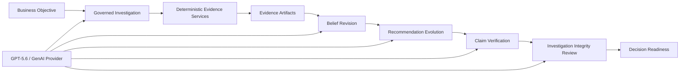

# Analytics Workstation

Analytics Workstation is an evidence-governed AI investigation platform that transparently evolves its recommendations as evidence accumulates.

It is not a dashboard and it is not a chat wrapper. It is a local-first analytical operating environment where business questions become governed investigations, investigations produce evidence, evidence revises beliefs, and recommendations are challenged before anyone is asked to trust them.

The Build Week demonstration shows one complete loop:

```text
Objective
-> Observation
-> Uncertainty
-> Competing explanations
-> Evidence collection
-> Belief revision
-> Recommendation evolution
-> Claim verification
-> Investigation integrity review
-> Decision readiness
```

The core idea is simple: Analytics Workstation does not merely produce an answer. It preserves the reasoning path that made the answer credible.

## Why It Is Different

Most analytical tools optimize for output production: a dashboard, a notebook, a model, or a report. Analytics Workstation optimizes for accountable investigation.

- **Evidence before conclusions**: artifacts are treated as durable evidence, not disposable outputs.
- **Governed AI operation**: AI can frame, synthesize, and propose within bounded contracts; deterministic services compute the facts.
- **Belief revision**: recommendations are allowed to evolve as new evidence changes the investigation state.
- **Claim verification**: final claims remain traceable to evidence, diagnostics, methods, assumptions, and limitations.
- **Skeptical self-review**: the investigation explicitly searches for reasons its own recommendation could be wrong.
- **Local-first fallback**: the demo can run deterministically with a mock provider when a live model is unavailable.

## Build Week Submission Package

Start here for judging, recording, or reviewing the final demo:

- `docs/submission_package.md`: concise product summary, architecture diagram, submission text, and screenshot checklist.
- `docs/demo_script_3_minute.md`: three-minute recording script.
- `docs/judge_faq.md`: short answers to likely judge questions.
- `docs/final_demo_reliability_checklist.md`: fresh-run checklist before recording.
- `docs/design_principles.md`: the product principles that govern the experience.
- `docs/build_week_demo_guide.md`: operational demo guide and presenter pacing.

## Architecture At A Glance



Deterministic services perform data generation, EDA, regression diagnostics, SHAP evidence, validation, and report-contract construction. GPT-5.6 operates through the provider-agnostic GenAI layer for investigation framing, semantic synthesis, belief evolution, recommendation narrative, claim verification, and integrity review. The AI does not receive arbitrary permission to mutate the project.

## Repository Boundary

This repository owns the app/product layer:

- Shiny app logic
- AutoPlots calls
- plot registries and options
- project state
- export behavior
- generated report code
- UI behavior inside the Shiny app

The AutoPlots package remains an external dependency. AutoPlots plotting internals should not be copied into this repository.

## Ecosystem Operating Model

AnalyticsShinyApp is the central product and coordination repo for the local-first analytics report builder ecosystem.

Start with these docs before architecture-affecting work:

- `docs/architecture_constitution.md`: product principles, boundary rules, QA expectations, and deferred scope.
- `docs/public_private_ip_boundary.md`: public AutoQuant vs private AnalyticsShinyApp placement rules for APIs, docs, compiler assets, lever management, roadmap, and product intelligence.
- `docs/cross_repository_agent_guide.md`: cross-repository workspace manifest, validation modes, failure classification, and agent entry commands.
- `docs/ecosystem_operating_model.md`: single-developer operating loop, workflow lifecycle, artifact flow, and Code Runner rules.
- `docs/repo_contracts.md`: ownership boundaries for AnalyticsShinyApp, AutoQuant, AutoPlots, Rodeo, PolarsFE, Benchmarks, and shinyelectron.
- `docs/project_artifact_collector.md`: project-level artifact aggregation contract, bundle lifecycle, manifest, screenshot policy, and DOCX collector workflow.
- `docs/render_target_architecture.md`: explicit human vs LLM render target policies and `ExportPNG` semantics.
- `docs/artifact_quality_policy.md`: shared artifact component expectations, completeness scoring, and graceful degradation rules.
- `docs/table_artifact_architecture.md`: canonical table artifacts, table render targets, sorting policies, previews, and backing data sidecars.
- `docs/semantic_intelligence_integration.md`: project-authored business intent, decision memory, semantic workspace validation, and AutoQuant Semantic Intelligence integration.
- `docs/decision_workflow_architecture.md`: governed decision follow-through, proportional workflow, review/approval, implementation, outcome learning, Mission Control work queue, and bounded GenAI guardrails.
- `docs/decision_workflow_user_guide.md`: practical route from business question to closed decision.
- `docs/epistemic_integrity_architecture_review.md`: architectural review of reasoning vulnerability, human intervention provenance, claim governance, and reuse boundaries.
- `docs/epistemic_integrity_phase1.md`: implemented portable epistemic contracts, provenance, claim governance, gates, app integration, and compiled runtime linkage.
- `docs/knowledge_compilation_runtime_architecture.md`: Phase 0 architecture for compiling source philosophy and contracts into AI runtime bundles.
- `docs/knowledge_compilation_runtime_phase1.md`: implemented Phase 1 source registry, curated knowledge units, runtime bundles, task routing, context packages, and QA.
- `docs/knowledge_compilation_runtime_phase2.md`: implemented Phase 2 epistemic runtime expansion, model-tier context compilation, governed operator validation, diagnostics, caching, benchmarking, and AI Runtime page.
- `docs/knowledge_compilation_runtime_phase3.md`: implemented Phase 3 task-scoped model qualification, benchmark artifacts, epistemic fidelity scoring, bundle variant comparison, and safe Class 2 validation boundaries.
- `docs/knowledge_compilation_runtime_phase4.md`: implemented Phase 4 progressive artifact retrieval, read-only artifact navigation, digest caching, context sufficiency, retrieval diagnostics, and retrieve-everything benchmarks.
- `docs/knowledge_compilation_runtime_phase5.md`: implemented Phase 5 cross-artifact synthesis planning, applicability, contradiction handling, evidence sufficiency, coverage, structured cited synthesis, and synthesis compression benchmarks.
- `docs/knowledge_compilation_runtime_phase6.md`: implemented Phase 6 governed evidence review, evidence binders, sufficiency for action, ranked supported next actions, preview-only drafts, and operator audit records.
- `docs/knowledge_compilation_runtime_phase7.md`: implemented Phase 7 confirmed draft persistence for evidence-review and campaign-seed drafts through governed Class 3 handlers, project state, collector append, audit, and undo/archive lifecycle.
- `docs/knowledge_compilation_runtime_phase8.md`: implemented Phase 8 mutation taxonomy, risk assessment, governance policy, review-request draft persistence, evidence-link draft persistence, mutation audit, and lifecycle management.
- `docs/platform_productization_phase1.md`: platform-level bottleneck assessment, subsystem maturity, PFSD observations, and productization roadmap.
- `docs/product_experience_intelligence_architecture.md`: deterministic demo worlds, Golden Workflow replay, repo-local browser runtime provisioning, scenario contracts, review artifacts, UX regression metrics, Playwright recorder decision, and product-experience campaign loop.
- `docs/api_surface_audit.md`: aggressive pre-product API/product surface audit and cleanup recommendations.
- `docs/agent_task_template.md`: recommended Codex task framing.

Core operating rules:

- AutoQuant owns analytics, artifact generators, and analytical report rendering.
- AutoPlots owns high-level plot functions, themes, and display helpers.
- The Project Artifact Collector owns project-level artifact aggregation and the primary project DOCX.
- Human reports and LLM collectors are independent render targets built from the same underlying artifacts.
- AnalyticsShinyApp owns the conservative deterministic Feature Engineering / Model Preparation workflow that creates visible prepared-data artifacts without mutating source data.
- AnalyticsShinyApp owns the project-authored Semantic Intelligence workspace; AutoQuant owns the canonical business-intent and decision-management analytical contracts.
- AnalyticsShinyApp owns the operational decision-workflow experience: guided authoring, proportional governance recommendations, evidence inboxes, next-action queues, stale-state explanations, and collector registration.
- Rodeo and PolarsFE remain future homes for richer R/Python feature engineering engines if they are integrated intentionally.
- Benchmarks owns performance evidence.
- shinyelectron owns packaging/runtime.
- Code Runner is the only custom code execution system.
- Workflow actions are user-triggered unless explicitly designed otherwise.

Workflow terminology:

- Model Readiness is pre-model Target Analysis: target diagnostics, leakage checks, drift, class balance, missingness, and readiness recommendations.
- Feature Engineering / Model Preparation creates reproducible prepared-data artifacts and transformation lineage before training.
- CatBoost Builder trains and scores models when the user runs it.
- Model Assessment is post-model evaluation of trained/scored output: RMSE, MAE, ROC, PR, lift, gains, calibration, residual diagnostics, and holdout performance.
- The preferred pre-model AutoQuant adapter id is `autoquant_model_readiness`; `autoquant_model_assessment` is a legacy compatibility alias only.

## Dependencies

Core R packages required for the workstation include:

- `AutoPlots`
- `AutoQuant`
- `shiny`
- `data.table`
- `htmltools`
- `htmlwidgets`
- `openxlsx`

Install released dependencies in R:

```r
install.packages(c("shiny", "data.table", "htmltools", "htmlwidgets", "openxlsx"))
```

Install the local ecosystem packages separately before running this app. If you use GitHub-hosted builds:

```r
install.packages("remotes")
remotes::install_github("AdrianAntico/AutoPlots")
remotes::install_github("AdrianAntico/AutoQuant")
```

During local ecosystem development, point your R library at local package installs instead of adding dev-only loading to this app:

```r
remotes::install_local("../AutoPlots")
remotes::install_local("../AutoQuant")
```

Production app code should call package APIs through the installed packages:

```r
library(AutoPlots)
library(AutoQuant)
```

Do not add `devtools::load_all("../AutoPlots")`, `devtools::load_all("../AutoQuant")`, or source internal package files in this repository.

Optional feature packages used by richer workstation paths include:

- `reactable` for premium interactive tables;
- `jsonlite` for JSON sidecars, manifests, and runtime bundles;
- `httr2` and `curl` for GenAI provider endpoints;
- `mirai` and `callr` for async or isolated execution paths;
- `arrow` for Parquet data loading;
- `commonmark` for markdown rendering in the Knowledge Library;
- `base64enc` and `png` for artifact previews and screenshots;
- `digest` and `yaml` for audit, storage, and technical-debt utilities;
- `testthat` for deterministic QA.

The app should degrade gracefully when optional integrations are unavailable, but full Build Week validation expects the local development environment to include them.

## Run Locally

From this repository root:

```r
shiny::runApp(".")
```

Or from a terminal:

```powershell
Rscript -e "shiny::runApp('.')"
```

The app performs a lightweight startup dependency check through `check_app_dependencies()` before loading the Shiny UI.

## Build Week Demo

Analytics Workstation includes a dedicated **Build Week Demo** route under `More`.

The demo shows one governed analytical investigation:

```text
User Objective
-> GPT-5.6 or deterministic mock provider
-> Agent Plan
-> EDA
-> Regression Model Insights
-> Approval Gate
-> SHAP Analysis
-> Evidence
-> Campaign ReportContract
-> Interactive Report Browser
-> Claim Verification
```

For live OpenAI operation, set one of:

```powershell
$env:OPENAI_API_KEY="sk-..."
$env:ANALYTICS_GENAI_PROVIDER="openai"
$env:ANALYTICS_GENAI_MODEL="gpt-5.6"
```

For deterministic local rehearsal, choose **Mock rehearsal** in the Build Week Demo page. The mock path exercises the same app contracts without calling a paid provider.

Codex built the workstation: source code, UI, tests, contracts, and docs. GPT-5.6 operates the workstation through the provider-agnostic GenAI layer and bounded agent-operation contract; it does not receive arbitrary permission to mutate the project outside governed actions.

See:

- `docs/build_week_demo_guide.md`
- `docs/build_week_demo_plan.md`
- `docs/build_week_demo_gap_audit.md`

## Table Filters

Reactable-backed table artifacts support text exclusion filters:

- `Impressions` keeps rows containing `Impressions`
- `!Impressions` excludes rows containing `Impressions`
- `-Impressions` also excludes rows containing `Impressions`

Text filtering is case-insensitive. Numeric and date columns keep their standard table behavior.

## Sample Data

Sample QA data is available at:

- `inst/sample_data/app_qa_transactional.csv`

It includes `Date`, `Channel`, `Category`, `Spend`, `Revenue`, `Clicks`, `XNum`, `YNum`, and `ZVal`.

## Electron Wrapper

This app may be run inside an Electron shell maintained outside this repository.

Known Electron wrapper source:

- `AdrianAntico/<ELECTRON_FORK_REPO_NAME>`

The Electron wrapper repository owns Electron startup, R/Shiny process launch, desktop window behavior, packaging, local server lifecycle, and Electron-specific file/path behavior.

If a smoke test fails in both browser Shiny and Electron, fix this repository. If it fails only in Electron, inspect the Electron wrapper repository first.

See `docs/electron_smoke_test.md`.

## Smoke Test Checklist

Detailed smoke steps are in `docs/smoke_test.md`.

Basic Shiny app smoke:

- app launches from this repository
- upload `inst/sample_data/app_qa_transactional.csv`
- build Line plot
- add `p1`
- build Bar plot
- add `p2`
- preview Grid layout
- assign sections
- preview Sections layout
- export R code
- export HTML; when `AutoPlots::save_widget()` is unavailable, the app falls back to an HTML file plus asset directory
- save/load project `.rds`
- save/load project bundle

Generated code smoke:

- report code uses `AutoPlots::<PlotType>()`
- report code uses `AutoPlots::display_plots_grid()` or `AutoPlots::display_plots_sections()`
- bundle-loaded report code uses the bundled `data.csv` path

## Notes

This repository was copied out of the AutoPlots package repository so app/product code can evolve separately from the plotting package. Do not delete the old app copy from AutoPlots until this repository has passed the expected app and Electron smoke tests.
