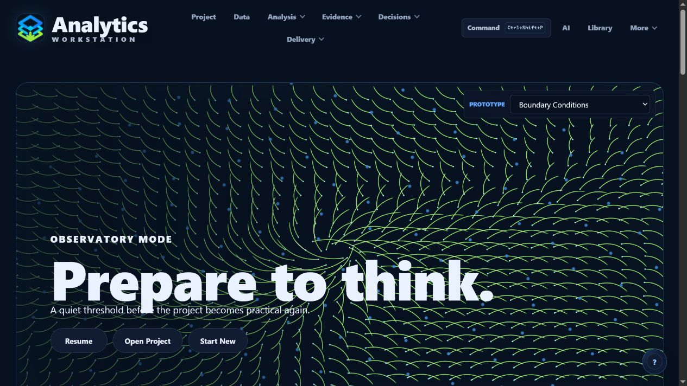
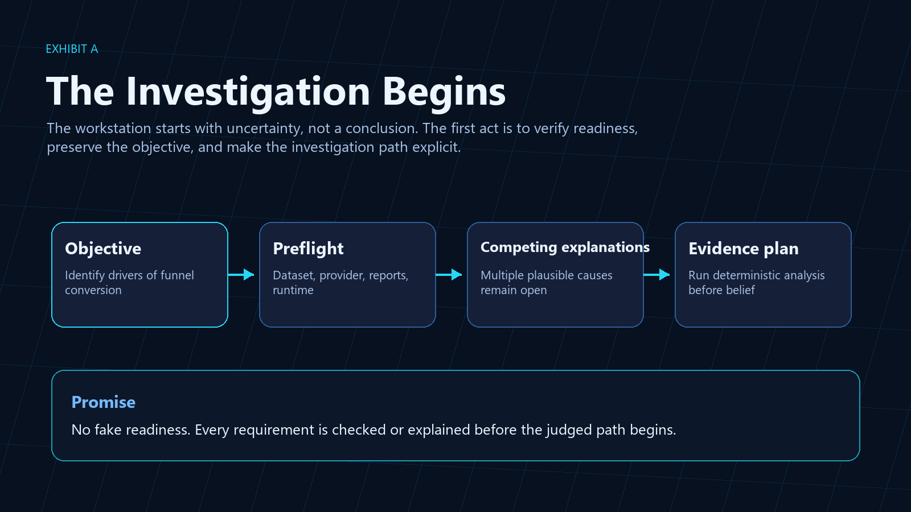
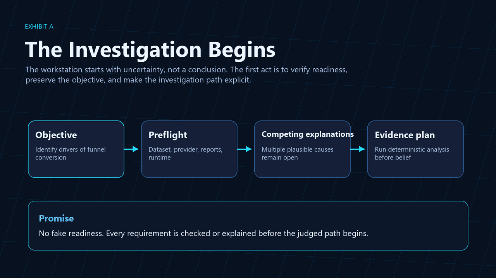
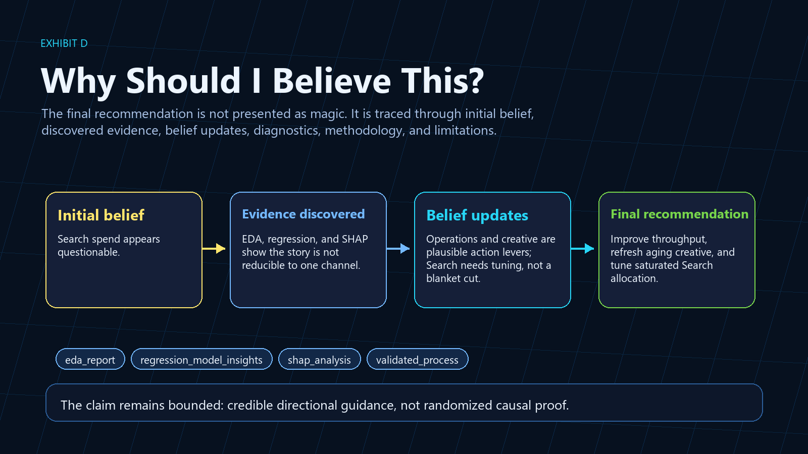
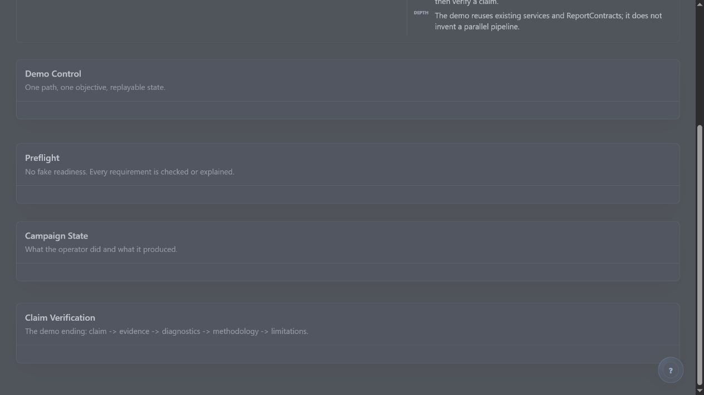
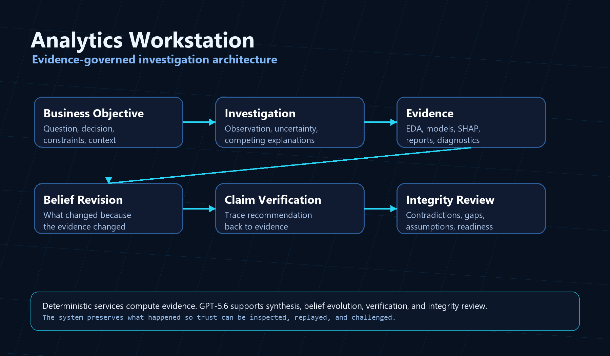

# Analytics Workstation

**Version:** `1.0.0-buildweek`

**Software that investigates before it recommends.**

Analytics Workstation is an evidence-governed AI investigation platform for analytical work that cannot be reduced to a dashboard, notebook, report, or one-shot AI answer.

It helps move from a business objective to a decision-ready recommendation by preserving the investigation itself: what was observed, what remained uncertain, which explanations competed, what evidence was gathered, how beliefs changed, which claims were verified, and why the final recommendation deserves trust.

> Analytics Workstation does not just produce answers. It conducts transparent investigations that can revise their conclusions as evidence accumulates, then critique their own recommendations before asking for trust.

<p align="center"><strong>This project is both a software product and a documented experiment in AI-assisted software engineering.</strong></p>

## Evidence Exhibits

These figures combine product captures and curated evidence exhibits. They are not decoration; each one shows a part of the investigation loop the product preserves.

### Figure 1 - Arrival At The Edge Of The Known

The workstation opens as a place to think before it becomes a place to operate.



### Figure 2 - The Investigation Begins

The Build Week demonstration starts with uncertainty, not a conclusion: an objective, readiness checks, competing explanations, and an explicit evidence plan.



### Figure 3 - Belief Revision

The recommendation is allowed to change because the evidence changed.



### Figure 4 - Claim Verification

The system can answer why a final claim deserves belief by tracing it through evidence, diagnostics, methodology, and limitations.



### Figure 5 - Integrity Review

The investigation ends by challenging its own conclusion before asking the user to trust it.



### Figure 6 - Architecture In One Frame

Deterministic services compute evidence; GPT-5.6 supports synthesis, belief evolution, verification, and integrity review inside bounded contracts.



## What The Build Week Demo Shows

The Build Week demo is a focused investigation over a deterministic synthetic enrollment-growth dataset.

In a few minutes, the viewer should see:

1. A business objective become a governed investigation.
2. The system record uncertainty before recommending action.
3. Competing explanations remain visible.
4. Deterministic analytics generate evidence.
5. The recommendation change as evidence changes.
6. The final claim verified against evidence.
7. The workstation challenge its own conclusion.
8. Decision readiness stated transparently.

The most important moment is not that the system gives an answer. The important moment is that the system can answer:

> Why should I believe this?

## What GPT-5.6 Does

GPT-5.6 is used where probabilistic synthesis is useful:

- investigation framing;
- semantic synthesis;
- belief-evolution narrative;
- recommendation evolution;
- claim verification;
- integrity-review explanation.

It is not used to invent evidence or replace deterministic analytics.

Deterministic services remain responsible for data generation, EDA, regression diagnostics, SHAP evidence, validation, replay, report-contract construction, and QA.

## Why It Is Different

| Traditional analytics | LLM dashboards | Analytics Workstation |
|---|---|---|
| Shows metrics and outputs | Adds natural-language summaries | Preserves the investigation path |
| Often hides rejected explanations | Explains whatever context is pasted in | Tracks competing explanations explicitly |
| Produces static recommendations | Produces fluent answers | Revises recommendations as evidence changes |
| Separates reports from evidence | Summarizes artifacts after the fact | Links claims back to evidence |
| Leaves trust to the presenter | Can sound confident without proof | Performs skeptical integrity review before action |

The product is not trying to make analytics feel magical. It is trying to make analytical reasoning visible, governed, and reusable.

## The Story Behind The Product

The repository is also evidence from a development experiment.

As AI-assisted implementation made many coding steps cheaper, the project repeatedly spent that savings on harder questions about evidence, governance, representation, trust, product experience, and architectural coherence.

Read the canonical historical narrative:

- [docs/the_story.md](docs/the_story.md)

For the longer development record, see:

- [docs/development_ordeal.md](docs/development_ordeal.md)

## Build Week Demo Path

Run the app, then open:

```text
More -> Build Week Demo
```

For deterministic rehearsal, select `Mock rehearsal`. This exercises the same app contracts without a paid provider call.

For a live GPT-5.6 path, set:

```powershell
$env:OPENAI_API_KEY="sk-..."
$env:ANALYTICS_GENAI_PROVIDER="openai"
$env:ANALYTICS_GENAI_MODEL="gpt-5.6"
```

Then run:

1. `Run Preflight`
2. `Launch Demo`
3. `Why should I believe this?`
4. `Report Browser`
5. `Replay`
6. `Reset`

## Run Locally

For the installed-package path:

```r
install.packages("release/AnalyticsShinyApp_1.0.0.tar.gz", repos = NULL, type = "source")
library(AnalyticsShinyApp)
run_workstation()
```

For source-tree development from the repository root:

```r
shiny::runApp(".")
```

Or from PowerShell:

```powershell
Rscript -e "shiny::runApp('.')"
```

The app performs startup dependency checks before loading the Shiny UI.

## Install On Windows

For the normal Windows desktop workflow, run the installer from the repository root. This installs the R package, prepares the Electron shell when Node.js/npm are available, and creates a Start Menu launcher:

```powershell
powershell -NoProfile -ExecutionPolicy Bypass -File .\install_windows.ps1
```

For a Desktop shortcut:

```powershell
powershell -NoProfile -ExecutionPolicy Bypass -File .\install_windows.ps1 -DesktopShortcut
```

The installer:

- installs R dependencies and sibling first-party packages;
- installs the `AnalyticsShinyApp` R package;
- launches from installed package resources rather than copied developer source;
- prepares the Electron shell when Node.js and npm are available;
- creates a Start Menu launcher;
- runs package and distribution diagnostics.

### Run The Electron Desktop App

After installation, launch the desktop app from:

```text
Start Menu > Analytics Workstation
```

Or run the installed Electron launcher directly:

```powershell
& "$env:LOCALAPPDATA\Programs\Analytics Workstation\Analytics Workstation Electron.cmd"
```

The main launcher is:

```powershell
& "$env:LOCALAPPDATA\Programs\Analytics Workstation\Analytics Workstation.cmd"
```

It opens Electron when Electron dependencies are installed. If Electron is not available, it falls back to the browser launcher so the workstation still opens.

To intentionally run the browser version:

```powershell
& "$env:LOCALAPPDATA\Programs\Analytics Workstation\Analytics Workstation Browser.cmd"
```

If Chrome or your default browser opens, you are using the browser fallback path rather than the Electron shell.

Installed app assets live under:

```text
R package library: AnalyticsShinyApp/app
```

User projects, exports, logs, cache, and runtime state live under:

```text
%LOCALAPPDATA%\AnalyticsWorkstation\
```

See:

- [docs/windows_installation.md](docs/windows_installation.md)
- [docs/package_architecture.md](docs/package_architecture.md)
- [docs/electron_distribution.md](docs/electron_distribution.md)
- [docs/troubleshooting_installation.md](docs/troubleshooting_installation.md)

## Installation And Dependencies

The Windows installer is preferred for end-user setup. For local development or after switching R versions, run the dependency installer directly:

```powershell
Rscript scripts/install_app_dependencies.R
```

Core R packages required for startup:

- `AutoPlots`
- `AutoQuant`
- `data.table`
- `echarts4r`
- `htmltools`
- `htmlwidgets`
- `openxlsx`
- `shiny`

The dependency installer reads `DESCRIPTION`, installs declared CRAN packages with recursive dependencies, then installs first-party ecosystem packages from sibling repositories when available:

- `../AutoPlots`
- `../AutoQuant`
- `../AutoNLS`
- `../Rodeo`

If a sibling repository is not available, the installer falls back to the canonical GitHub repository for that package and fails loudly if any required first-party capability remains unavailable. This is the preferred path after switching R versions, refreshing sibling repositories, or validating a fresh machine.

Install released CRAN dependencies:

```r
install.packages(c("shiny", "data.table", "echarts4r", "htmltools", "htmlwidgets", "openxlsx"))
```

Install the local ecosystem packages:

```r
install.packages("remotes")
remotes::install_github("AdrianAntico/AutoPlots")
remotes::install_github("AdrianAntico/AutoQuant")
remotes::install_github("AdrianAntico/AutoNLS")
remotes::install_github("AdrianAntico/Rodeo")
```

During local development, use local installs:

```r
remotes::install_local("../AutoPlots")
remotes::install_local("../AutoQuant")
remotes::install_local("../AutoNLS")
remotes::install_local("../Rodeo")
```

`AutoNLS` is the optional nonlinear effect-curve backend exposed through SHAP effect-curve controls and executed through AutoQuant when available. It is not required for app startup. If unavailable, the app should keep running and effect-curve paths should degrade explicitly.

Other optional packages used by richer workstation paths include:

- `arrow` for Parquet loading;
- `base64enc`, `png`, and `chromote` for artifact previews and screenshots;
- `callr`, `mirai`, and `ps` for async or isolated execution paths;
- `commonmark` for markdown rendering;
- `curl`, `httr`, and `httr2` for GenAI provider endpoints;
- `digest` and `yaml` for audit, storage, and technical-debt utilities;
- `jsonlite` for JSON sidecars, manifests, and runtime bundles;
- `reactable` for interactive tables;
- `roxygen2` and `testthat` for development and QA.

Do not use `devtools::load_all()` or source internal package files from sibling repositories in production app code. Install package dependencies into the active R library instead.

To check whether the active R runtime sees the expected capability set:

```r
library(AnalyticsShinyApp)
workstation_diagnostics()
qa_package_distribution()
```

## Validation

Useful checks before recording or submitting:

```powershell
& "C:\Program Files\R\R-4.5.2\bin\Rscript.exe" scripts\run_deterministic_qa.R
& "C:\Program Files\R\R-4.5.2\bin\Rscript.exe" -e "testthat::test_file('tests/testthat/test-build-week-demo.R')"
git diff --check
```

See [docs/final_demo_reliability_checklist.md](docs/final_demo_reliability_checklist.md) for the full recording gate.

## Repository Layout

- `R/`: application services, pages, contracts, QA helpers, and orchestration.
- `inst/app/`: package-installed UI assets, config defaults, and deterministic demo data.
- `www/`: source-tree mirror of workstation styling, branding, and client assets for development.
- `docs/`: architecture, demo, product, and submission documentation.
- `docs/media/`: product captures, evidence exhibits, and browser-recorded videos.
- `data/`: deterministic Build Week demo data.
- `tests/`: deterministic testthat coverage.
- `scripts/`: data generation, validation, and dependency helpers.
- `release/`: Build Week release candidate artifacts.

## Contributor Starting Points

If you are new to the repository, start here:

1. [docs/architecture_orientation.md](docs/architecture_orientation.md)
2. [docs/development_principles.md](docs/development_principles.md)
3. [docs/contributor_roadmap.md](docs/contributor_roadmap.md)
4. [CONTRIBUTING.md](CONTRIBUTING.md)
5. [docs/README.md](docs/README.md)

Before opening a pull request, run the validation commands in [CONTRIBUTING.md](CONTRIBUTING.md) and check [docs/open_source_readiness.md](docs/open_source_readiness.md) for known repository-health follow-ups.

## Current Scope

The Build Week path is a focused product demonstration, not a claim of general autonomous analysis. It deliberately avoids arbitrary action execution, broad task planning, hidden evidence mutation, and unsupported provider behavior.

That restraint is part of the product philosophy: the workstation should earn trust through transparent evidence, not through unchecked automation.
