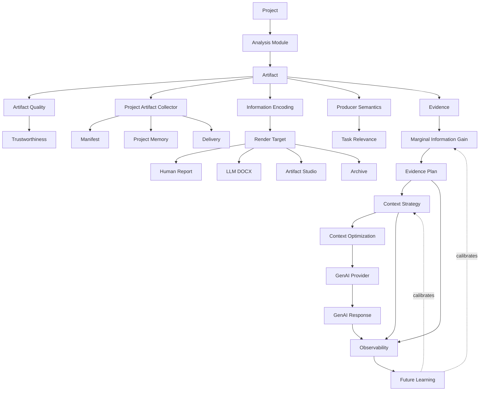

# Analytics Workstation Architecture Synthesis

Purpose: synthesize the growing architecture, policy, UX, and research documents into one coherent knowledge structure.

This document is a map, not a replacement for the source documents. It compresses the current architecture so a future reader can understand the system quickly, then use the specialized documents for details.

## 1. Executive Summary

Analytics Workstation is an evidence-centered analytical operating environment.

It is not primarily a dashboard, report exporter, or Shiny application. Shiny provides the reactive engine: state, routing, module orchestration, server communication, and UI outputs. The product is larger than Shiny. It is a project-centered workspace for creating, inspecting, preserving, routing, explaining, and communicating analytical evidence.

The core product model is:

```text
Project
-> Analysis modules
-> Standard artifacts
-> Project Artifact Collector
-> Render targets
-> Evidence routing
-> Context optimization
-> GenAI assistance
-> Observability
-> Future learning
```

Modules are evidence producers. Artifacts are durable analytical objects. The Project Artifact Collector is project memory. Human reports and LLM DOCX outputs are delivery targets, not separate analytical truths. Information encoding determines how the same artifact is represented for a consumer. Evidence routing decides which evidence belongs in a context package. Context optimization decides how to spend scarce tokens, latency, privacy, and model attention. GenAI is provider-agnostic, local-first, optional, and currently read-only.

The governing optimization idea is Marginal Information Gain: include evidence when it improves expected analytical understanding enough to justify its cost, given what is already known.

The workstation should help a user answer:

- Where am I in the project?
- What evidence exists?
- What evidence matters?
- What warnings remain?
- What can be trusted?
- What should happen next?
- What does the collector remember?
- What can AI explain using grounded evidence?

## 2. Core Mental Model

Use this hierarchy as the canonical mental model:

```text
Project
-> Artifacts
-> Information Encoding
-> Render Targets
-> Evidence Routing
-> Context Optimization
-> GenAI
-> Observability
-> Learning
```

### Project

The project is the world. It owns data, workflow state, runs, artifacts, collector state, reports, warnings, QA results, and future GenAI traces.

### Artifacts

Artifacts are standardized analytical evidence objects. They can contain plots, tables, metrics, diagnostics, recommendations, narratives, JSON, screenshots, backing sidecars, and metadata.

### Information Encoding

Information Encoding controls how the same analytical artifact is represented for a consumer:

- human
- LLM
- thumbnail
- presentation
- executive
- developer

The artifact identity remains stable. The representation changes.

### Render Targets

Render Targets answer where the encoded artifact goes:

- human report
- HTML report
- R Markdown
- LLM DOCX
- markdown
- PDF
- JSON archive
- Artifact Studio surfaces

Render target is delivery. Encoding is representation.

### Evidence Routing

Evidence Routing builds an evidence plan. It decides which artifacts should be excluded, mentioned, summarized, included as evidence, deep-dived, or requested as missing evidence.

### Context Optimization

Context Optimization governs the whole budget-constrained reasoning stack. It starts with deterministic facts, uses evidence routing, optionally uses probabilistic routing when deterministic rules are insufficient, and only then spends GenAI reasoning.

### GenAI

GenAI is a provider-agnostic service layer. The app calls shared functions such as `genai_chat()`, `genai_summarize_artifact()`, and `genai_brief_project()` rather than provider-specific APIs. GenAI is optional, local-first, and read-only in the current architecture.

### Observability

Observability records provider, model, context strategy, included components, token estimates, latency, image usage, downgrade reasons, output placeholders, and manual scoring fields. It makes evidence routing and GenAI behavior inspectable.

### Learning

Learning is future work. It should refine routing and context strategy estimates using telemetry, manual scoring, user ratings, provider comparisons, and repeated experiments. It should not replace explainability.

## 3. Concept Map



Conceptual relationships:

- Artifact becomes evidence when used to answer a question.
- Collector preserves project memory and delivery assets.
- Information Encoding changes representation without changing artifact identity.
- Render Target delivers the encoded artifact to a surface.
- Marginal Information Gain estimates whether evidence is worth adding.
- Evidence Plan records routing decisions.
- Context Strategy chooses artifact representation for GenAI.
- Context Optimization governs the overall deterministic-to-probabilistic sequence.
- GenAI Provider performs optional reasoning over routed evidence.
- Observability records what happened and enables future calibration.

## 4. Definitions And Glossary

### Analytical Artifact

A standardized project object representing analytical evidence. It may contain a plot, table, narrative, diagnostic, recommendation, metric, JSON payload, model summary, screenshot, sidecar path, or metadata.

### Artifact Bundle

A project/run/module-level package of artifacts submitted to the Project Artifact Collector. It records project id, run id, module id, status, artifacts, warnings, errors, diagnostics, and metadata.

### Artifact Quality

The shared policy for evaluating artifact completeness and usability. It records captions, screenshots, metadata, diagnostics, recommendations, tables, previews, sorting policy, backing files, JSON, and graceful degradation status.

### Artifact Studio

The workstation mode for browsing, filtering, inspecting, and understanding artifacts as first-class evidence objects. It is the evidence library and inspector experience.

### Collector

The Project Artifact Collector. It aggregates standardized artifact bundles across modules and runs, writes the primary collector DOCX, persists manifests, screenshots, and table sidecars, and acts as project memory.

### Context Optimization

The governance layer for deciding how to use deterministic facts, evidence routing, optional probabilistic routing, and GenAI reasoning under token, latency, privacy, provider, and decision constraints.

### Context Strategy

The representation strategy used for an artifact in a GenAI call. Examples include caption plus metadata, screenshot plus caption, table preview, full table when safe, structured JSON summary, balanced context, or sidecar reference.

### Delivery

The act of sending an encoded artifact to a surface such as a human report, LLM DOCX, Artifact Studio, markdown output, PDF, or archive. Delivery is governed by render targets.

### Evidence

An artifact used in support of a question, claim, decision, explanation, warning, or recommendation. Artifacts exist before a question. Evidence is artifact plus purpose.

### Evidence Plan

The routing output that records selected artifacts, excluded artifacts, mention-only artifacts, summaries, deep dives, missing evidence, context strategy choices, costs, utility estimates, confidence, and reasons.

### Evidence Routing

The deterministic and explainable selection layer that builds an evidence plan before GenAI reasoning. It uses quality, producer semantics, artifact metadata, provider capabilities, question type, user constraints, and expected utility.

### Evidence Strategy

The user-facing business posture for evidence routing. Examples include Efficient, Balanced, Thorough, Critical Decision, and Cost Is Irrelevant. It maps plain-language intent to technical routing configuration.

### GenAI Provider

A local or remote model service exposed through the provider-agnostic GenAI contract. Providers declare capabilities such as chat, generate, structured JSON, embeddings, vision, streaming, local, remote, free, paid, offline, and privacy preserving.

### Information Encoding

The consumer-specific representation of an analytical artifact. Human encoding optimizes readability and interaction. LLM encoding optimizes information density. Thumbnail encoding optimizes recognition. Executive encoding optimizes decisions. Developer encoding optimizes traceability.

### Marginal Information Gain

The expected improvement in analytical understanding caused by adding one more evidence item to the current context, given the question, selected evidence, provider capability, user objective, and decision criticality.

### Mission Control

The workstation mode for operational awareness: project health, workflow state, collector readiness, alerts, warnings, AI readiness, QA, and run timeline.

### Observability

The telemetry and trace layer for context construction, routing decisions, GenAI calls, strategy choices, model/provider behavior, latency, token estimates, image use, downgrade reasons, and manual scoring fields.

### Producer Semantics

Metadata supplied by artifact producers when they know analytical meaning. It includes analytical intent, artifact importance, render targets, policy source, table policies, plot policies, narrative purpose, and other semantic fields.

### Render Target

The delivery destination for an encoded artifact. Render target answers where the artifact goes. It does not answer how the artifact should be represented.

### Table Artifact

A canonical analytical table artifact with backing data as source of truth, policy-driven previews, sorting policy, CSV/JSON sidecars, metadata, and quality integration.

### Trustworthiness

A utility component used by routing and MIG. It estimates how much confidence to place in an artifact based on quality, metadata, diagnostics, sample size, warning status, producer reliability, and completeness.

### Workstation Mode

A major operational mode inside the same project environment. Current/future modes include Mission Control, Artifact Studio, Agentic Lab, Model Landscape, and Report/Evidence Storytelling.

## 5. Architecture Hierarchy

### Product Vision

Foundational document:

- `docs/vision/product_vision.md`

Role:

- defines product identity
- establishes the project-first, evidence-first worldview
- keeps Shiny as implementation substrate, not product identity
- explains workstation modes and north star

### Architectural Contracts

Core contracts:

- `docs/analysis_module_architecture.md`
- `docs/project_artifact_collector.md`
- `docs/render_target_architecture.md`
- `docs/report_plan_architecture.md`
- `docs/table_artifact_architecture.md`
- `docs/genai_service_architecture.md`
- `docs/ui_architecture.md`

Role:

- define object boundaries
- define module responsibilities
- define collector ownership
- define render target behavior
- define provider abstraction
- define UI component boundaries

### Policies

Policy documents:

- `docs/artifact_quality_policy.md`
- `docs/information_encoding_policy.md`
- `docs/context_optimization_policy.md`
- `docs/evidence_routing_policy.md`
- `docs/evidence_strategy_ux.md`
- `docs/marginal_information_gain_framework.md`

Role:

- govern behavior and future decisions
- clarify non-goals
- provide stable principles before implementation grows
- prevent module-specific one-off logic

### Research Layers

Research documents:

- `docs/research/ui_ux_research_sprint.md`
- `docs/genai_context_strategy_research.md`
- `docs/autoplots_composite_view_audit.md`
- plot sizing gallery artifacts

Role:

- preserve exploration
- compare alternatives
- identify hypotheses
- avoid premature product commitments
- inform future policy and prototypes

### UX Modes

Mode and UX documents:

- `docs/ui_ux_architecture.md`
- `docs/command_palette_architecture.md`
- `docs/roadmap/ux_roadmap.md`
- product vision mode definitions

Role:

- define how architecture becomes usable
- prevent the app from feeling like disconnected Shiny pages
- organize work around Mission Control, Artifact Studio, Agentic Lab, and future modes

### Future Work

Future-oriented areas:

- Agentic Lab
- Evidence Storytelling
- Model Landscape
- AutoPlots V2 consumer-aware encodings
- learned context strategy optimization
- richer observability dashboards
- permanent run history
- delivery studio/report-story builder

Role:

- build on existing architecture rather than bypassing it
- remain grounded in artifacts, collector memory, and explainable routing

## 6. Decision Principles

1. Do not spend probabilistic intelligence on deterministic facts.

Deterministic metadata, diagnostics, QA, quality, provider capability, and context size checks should run before GenAI reasoning.

2. Artifacts are evidence, not outputs.

Plots, tables, narratives, diagnostics, and recommendations should become durable analytical objects wherever practical.

3. Optimize marginal information gain, not token count alone.

The goal is useful analytical understanding per cost, not the smallest possible prompt.

4. Same artifact, different encoding by consumer.

Human, LLM, thumbnail, executive, presentation, and developer consumers may need different representations of the same artifact.

5. Render target is delivery. Encoding is representation.

Do not use `llm_docx` or `human_report` as substitutes for information encoding policy.

6. Evidence should be routed before GenAI reasoning.

GenAI should receive an explainable evidence package, not a raw dump of all available artifacts.

7. The collector owns project memory.

Individual modules produce artifacts. The project owns aggregation, manifesting, DOCX collection, and cross-run memory.

8. Producers should declare meaning when they know it.

Inference is useful for compatibility, but producer semantics are higher fidelity.

9. Tables are analytical objects, not screenshots.

Canonical data, sorting policy, previews, and sidecars matter more than a temporary interactive table view.

10. Screenshots use the production pipeline.

No second screenshot implementation should exist for collector or LLM evidence generation.

11. Missing optional components should degrade gracefully.

Missing screenshots, JSON, recommendations, or sidecars should be recorded as diagnostics and quality metadata, not fatal collector errors.

12. Begin conservative, learn over time.

Routing and strategy recommendations should start explainable and deterministic. Learning should refine estimates after telemetry and review exist.

13. Local-first does not mean local-only forever.

Local/private providers should work without paid APIs, but the provider contract should support future remote providers under explicit configuration.

14. UI should express architecture.

Mission Control, Artifact Studio, Command Palette, and future modes should make project state, evidence, collector memory, and next actions visible.

15. Avoid parameter explosion.

AutoPlots and app APIs should prefer named analytical helpers and policy objects over endless low-level flags.

## 7. Tensions And Unresolved Questions

### Evidence Routing vs Context Optimization

Current distinction:

- Context Optimization is the governing stack and budget philosophy.
- Evidence Routing is the artifact-selection layer that produces evidence plans.

Potential confusion:

- both discuss utility, cost, relevance, novelty, trust, and context strategy.

Recommendation:

- keep Context Optimization as the parent policy
- keep Evidence Routing as the operational planning layer
- consistently describe Evidence Routing as Layer 2 inside Context Optimization

### Render Target vs Information Encoding

Current distinction:

- Render Target means where the artifact goes.
- Information Encoding means how the artifact is represented.

Potential confusion:

- `llm_docx` often implies LLM encoding, but they are not identical.

Recommendation:

- use the phrase "delivery target" when explaining render targets
- reserve "encoding" for consumer-specific representation

### Artifact Quality vs Trustworthiness

Current distinction:

- Artifact Quality measures completeness and component status.
- Trustworthiness is a routing/MIG concept that may use quality plus diagnostics, sample size, producer reliability, staleness, and warnings.

Potential confusion:

- quality score can be mistaken for analytical truth.

Recommendation:

- document trustworthiness as a derived utility feature, not a replacement for quality

### Context Strategy vs Evidence Strategy

Current distinction:

- Evidence Strategy is user-facing posture: Efficient, Balanced, Thorough, Critical Decision, Cost Is Irrelevant.
- Context Strategy is artifact-level representation: screenshot, table preview, full table, JSON summary, balanced, etc.

Potential confusion:

- both are called "strategy."

Recommendation:

- standardize language:
  - Evidence Strategy: business posture
  - Context Strategy: representation choice

### Export vs Delivery Studio

Current state:

- exports, layouts, collector DOCX, render targets, and report plans exist in related but separate concepts.

Potential confusion:

- "Export" sounds file-centric while the architecture is evidence/delivery-centric.

Recommendation:

- future UX may rename or reorganize export surfaces around "Delivery" or "Report and Evidence Storytelling"
- keep current export behavior stable until the mode is designed

### Deterministic Rules vs Probabilistic Routing

Current stance:

- deterministic routing first
- probabilistic routing only when deterministic metadata cannot decide confidently

Open question:

- when does semantic overlap, novelty, or expected usefulness justify an LLM-assisted routing step?

Recommendation:

- do not introduce probabilistic routing until observability and manual review can evaluate whether it improves outcomes

### Local vs Paid GenAI Responsibilities

Current stance:

- local-first
- no paid provider required
- provider abstraction should support remote providers later

Open question:

- how should the UI expose cost, privacy, quality, and capability tradeoffs without nudging users into unsafe defaults?

Recommendation:

- keep paid provider use explicit
- surface local/privacy status everywhere GenAI actions appear

### Collector vs Report Plan

Current distinction:

- Collector is project memory and LLM DOCX corpus.
- Report Plan is a curated human/delivery structure.

Potential confusion:

- both can contain ordered artifacts and sections.

Recommendation:

- describe collector as "memory and corpus"
- describe report plan as "curation and presentation"

### Artifact Studio vs Artifact Library

Current distinction:

- Artifact Library is the inventory concept.
- Artifact Studio is the workstation mode for exploration and inspection.

Potential confusion:

- older docs may refer to Artifact Library as a page.

Recommendation:

- standardize "Artifact Studio" for the primary UX mode
- use "artifact library" for the underlying inventory/data concept

### AutoPlots Human Defaults vs LLM Encodings

Current stance:

- AutoPlots default dark theme and high-level APIs remain stable
- future composite and encoding work should avoid parameter explosion

Open question:

- where should LLM-specific plot density live: AutoPlots, app policy, collector encoding, or all three?

Recommendation:

- keep analytical plot construction in AutoPlots
- keep selection/routing in Analytics Workstation
- use explicit named composite helpers before any general grammar

## 8. Proposed Cleanup Recommendations

### Foundational Docs To Keep Stable

These should remain high-level references and change slowly:

- `docs/vision/product_vision.md`
- `docs/marginal_information_gain_framework.md`
- `docs/context_optimization_policy.md`
- `docs/evidence_routing_policy.md`
- `docs/information_encoding_policy.md`
- `docs/render_target_architecture.md`
- `docs/project_artifact_collector.md`

### Architecture Contracts To Maintain As Living Specs

These should evolve with implementation:

- `docs/analysis_module_architecture.md`
- `docs/artifact_quality_policy.md`
- `docs/table_artifact_architecture.md`
- `docs/genai_service_architecture.md`
- `docs/report_plan_architecture.md`
- `docs/ui_architecture.md`
- `docs/ui_ux_architecture.md`
- `docs/command_palette_architecture.md`

### Research References To Preserve

These should keep exploratory history and not be over-polished:

- `docs/research/ui_ux_research_sprint.md`
- `docs/genai_context_strategy_research.md`
- `docs/autoplots_composite_view_audit.md`
- plot sizing gallery HTML/DOCX and images

### Docs That Might Be Merged Later

Potential future consolidation:

- `docs/genai_architecture.md` and `docs/genai_service_architecture.md`, if they overlap
- `docs/ui_architecture.md` and `docs/ui_ux_architecture.md`, if the doctrine and implementation guidance diverge
- `docs/evidence_strategy_ux.md` into `docs/evidence_routing_policy.md` or kept as the UX-facing companion
- module-specific docs into a single module catalog if maintenance becomes heavy

Do not merge prematurely. These documents currently preserve useful distinctions.

### Terminology To Standardize

Recommended standard terms:

- Analytics Workstation, not just AnalyticsShinyApp, when describing product identity
- Workstation Mode, not page, for Mission Control, Artifact Studio, Agentic Lab, and future Model Landscape
- Artifact Studio for the UX mode
- artifact library for the underlying inventory
- Project Artifact Collector for the canonical memory layer
- LLM DOCX for the render target
- LLM encoding for the representation
- Evidence Strategy for user-facing posture
- Context Strategy for artifact representation in GenAI calls
- Evidence Plan for routing output
- Marginal Information Gain for utility theory

### Missing Diagrams

Useful diagrams to add later:

- full artifact lifecycle from module run to collector, report, Artifact Studio, and GenAI
- render target vs information encoding matrix
- Evidence Routing inside Context Optimization
- GenAI provider abstraction and context telemetry flow
- Workstation mode map
- report plan vs collector distinction
- permanent run history and manifest lineage

### Roadmap Refinements

Suggested roadmap refinements:

- add an explicit "Delivery Studio / Evidence Storytelling" phase name once export/report UX direction stabilizes
- add "MIG observability and scoring" as a Phase 5 research/product milestone
- add "trustworthiness model" as a research item separate from artifact quality
- add "render target x encoding matrix" as a design-system/data-contract milestone
- add "permanent run history" as a prerequisite for deeper Mission Control and lineage work

## 9. Next Architectural Priorities

1. Build a canonical architecture index.

Create a front-door document or README section that points readers from product vision to contracts, policies, research, UX, and module docs.

2. Formalize the artifact lifecycle diagram.

Show one artifact moving from producer to quality policy, table/plot policy, collector, render target, Artifact Studio, evidence routing, GenAI context, and observability.

3. Clarify report plan vs collector vs delivery.

The collector is memory. A report plan is curation. Delivery is target-specific output. This distinction will matter before Story Builder or Delivery Studio work.

4. Add a render target x information encoding matrix.

Document which encodings are expected for each target and where exceptions are allowed.

5. Define a trustworthiness model.

Artifact Quality is not enough by itself. Trustworthiness should combine quality, diagnostics, producer semantics, data adequacy, warning severity, and staleness.

6. Make MIG observable before making it automatic.

Add conceptual trace fields and review workflows before any learned or automatic MIG optimization.

7. Stabilize Evidence Strategy language in the UI.

Users should pick business posture, not token mechanics. Technical settings should remain inspectable.

8. Establish permanent run history.

Mission Control, collector lineage, Artifact Studio chronology, and future Agentic Lab traces all need durable run events rather than reconstructed state alone.

9. Keep GenAI read-only until grounding and permissions are mature.

Agentic Lab should wait for evidence grounding, preview-before-commit, action permissions, and traceability.

10. Continue AutoPlots composite work through named prototypes.

`ImportancePareto()` is the first prototype. Continue with a small number of high-value named composite views before considering any broader grammar.

11. Add architecture QA for terminology drift.

The documentation set is now large enough that terms such as encoding, render target, evidence strategy, context strategy, collector, report plan, and delivery should be linted or periodically audited.

12. Preserve research history while adding synthesis.

Do not flatten research docs into polished certainty. Keep research exploratory, policies stable, contracts precise, and synthesis documents navigable.

## Source Document Map

Key documents synthesized:

- `docs/vision/product_vision.md`
- `docs/research/ui_ux_research_sprint.md`
- `docs/roadmap/ux_roadmap.md`
- `docs/analysis_module_architecture.md`
- `docs/artifact_quality_policy.md`
- `docs/project_artifact_collector.md`
- `docs/render_target_architecture.md`
- `docs/table_artifact_architecture.md`
- `docs/information_encoding_policy.md`
- `docs/context_optimization_policy.md`
- `docs/evidence_routing_policy.md`
- `docs/evidence_strategy_ux.md`
- `docs/genai_service_architecture.md`
- `docs/genai_context_strategy_research.md`
- `docs/marginal_information_gain_framework.md`
- `docs/ui_architecture.md`
- `docs/ui_ux_architecture.md`
- `docs/command_palette_architecture.md`
- `docs/report_plan_architecture.md`
- `docs/autoplots_composite_view_audit.md`

## Closing Synthesis

The architecture is converging around one coherent thesis:

```text
Analytics Workstation exists to preserve, organize, route, encode,
deliver, and reason over analytical evidence.
```

The most important distinction is that artifacts are durable evidence objects. Once that is true, the rest of the system becomes clearer:

- the collector remembers evidence
- quality evaluates evidence completeness
- table policy preserves tabular meaning
- producer semantics describe analytical intent
- information encoding adapts evidence to consumers
- render targets deliver evidence to surfaces
- evidence routing decides what matters for a question
- context optimization spends scarce reasoning budget
- GenAI explains routed evidence
- observability records what happened
- learning may eventually improve the routing frontier

The product should continue to evolve as a project-centered analytical operating environment, not a set of disconnected pages or exports.

