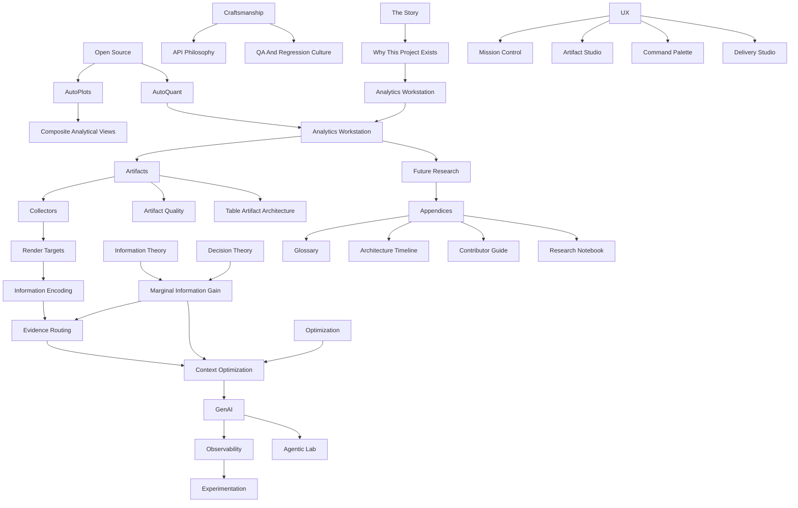

# Analytics Workstation Book Compiler Plan

Status: planning architecture only  
Purpose: define how the canonical Analytics Workstation knowledge base can evolve into books, white papers, talks, GPT knowledge bases, websites, documentation, and other render targets.

This document does not write the book. It designs the compiler.

## Executive Summary

Analytics Workstation has accumulated a body of knowledge that is larger than ordinary project documentation. It contains product philosophy, software architecture, research experiments, UX evolution, GenAI context strategy work, API philosophy, QA practices, implementation lessons, and a growing vocabulary for evidence-centered analytics.

The goal is not to prematurely condense this into a polished manuscript.

The goal is to create a canonical knowledge system.

```text
Truth
-> Knowledge Base
-> Representation
-> Delivery
```

The book is one representation. A GPT knowledge base is another. A conference talk is another. Developer documentation, white papers, websites, executive briefings, and research notebooks are all render targets over the same source of truth.

This plan treats the manuscript like a software system:

- source material is collected
- concepts are normalized
- dependencies are mapped
- chapters are compiled from Source Packs
- terminology has ownership
- outputs are rendered for audiences
- pruning happens late
- synthesis is repeatable

## Part I: Philosophy

### Why Not Write The Book Immediately?

A polished book is a compression artifact. It is not the canonical source.

Trying to write the polished version too early would force premature choices:

- which ideas matter most
- which language is final
- which concepts are central
- which experiments count as evidence
- which implementation details are noise
- which audience the work serves

That would be backwards. Analytics Workstation is still evolving. The architecture is coherent, but many ideas are still in active discovery: Marginal Information Gain, Information Encoding, Evidence Routing, GenAI context strategy research, Artifact Studio, Mission Control, AutoPlots composites, and future Agentic Lab.

The right process is:

```text
Expand
-> Cluster
-> Synthesize
-> Condense
```

### Expand

Preserve the raw material first.

Expansion captures:

- conversations
- decisions
- failed paths
- experiments
- implementation notes
- QA results
- architectural discoveries
- user reactions
- visual artifacts
- code evolution
- terminology changes

The purpose is not elegance. The purpose is preservation.

### Cluster

Group source material into concept families:

- artifacts and collectors
- render targets and information encoding
- evidence routing and context optimization
- GenAI service architecture
- UX modes
- AutoPlots evolution
- QA and software discipline
- research and experiments
- product philosophy

Clustering turns raw memory into navigable knowledge.

### Synthesize

Find the underlying architecture:

- what is stable
- what is still research
- what depends on what
- what vocabulary should become canonical
- what conflicts remain
- what concepts repeat under different names

Synthesis produces conceptual clarity without losing nuance.

### Condense

Only after expansion, clustering, and synthesis should the material be compressed into polished outputs.

Condensation is audience-specific:

- a book preserves the full story and theory
- a white paper explains one thesis
- a conference talk creates a narrative arc
- a GPT knowledge base favors complete reference coverage
- a website favors navigation and clarity
- executive summaries favor decisions and implications

The canonical knowledge base should remain richer than any one output.

## Part II: Canonical Knowledge Hierarchy

The compiler should treat each knowledge source as a typed input. Different sources have different authority, fidelity, and purpose.

### Conversations

Purpose:

- preserve discovery context
- capture reasoning in motion
- record decisions before they were formalized
- retain product intuition and user reactions

Examples:

- task prompts
- implementation discussions
- design critiques
- visual QA feedback
- conceptual breakthroughs
- "this is the real architecture" moments

Compiler treatment:

- high historical value
- high narrative value
- medium canonical authority until synthesized into docs or code

### Git History

Purpose:

- establish implementation chronology
- show architectural evolution
- identify when concepts became real
- support architecture timeline chapters

Examples:

- commits
- diffs
- PRs if available
- file histories
- code comments
- generated docs

Compiler treatment:

- high historical authority
- high implementation authority
- needs interpretation for narrative use

### Architecture Documents

Purpose:

- define current contracts, policies, and mental models
- establish canonical vocabulary
- explain boundaries and non-goals

Examples:

- Product Vision
- Architecture Synthesis
- Project Artifact Collector
- Render Target Architecture
- Information Encoding Policy
- Evidence Routing Policy
- Context Optimization Policy
- Marginal Information Gain Framework

Compiler treatment:

- high canonical authority
- primary source for definitions

### Research

Purpose:

- preserve exploration
- compare alternatives
- record hypotheses
- retain unfinished ideas

Examples:

- UI/UX Research Sprint
- GenAI Context Strategy Research
- AutoPlots Composite View Audit
- plot sizing gallery
- image-vs-data experiments

Compiler treatment:

- high idea value
- moderate canonical authority
- should not be over-polished into false certainty

### Experiments

Purpose:

- produce evidence about what works
- compare context strategies, encodings, providers, plot types, and UI approaches
- calibrate future claims

Examples:

- Ollama smoke tests
- image-vs-data studies
- plot-type-aware context strategy studies
- plot sizing gallery
- AutoNLS validation
- SHAP integration checkpoints

Compiler treatment:

- high empirical value
- requires metadata, caveats, and manual scoring status

### QA

Purpose:

- demonstrate engineering discipline
- preserve contracts
- reveal regression strategy
- distinguish design claims from implemented behavior

Examples:

- `qa_project_artifact_collector()`
- `qa_artifact_quality_policy()`
- `qa_table_artifact_policy()`
- `qa_genai_service_contract()`
- `qa_artifact_studio()`
- `qa_ui_consistency()`

Compiler treatment:

- high engineering value
- useful for appendices, proof points, and contributor docs

### API Evolution

Purpose:

- explain API philosophy
- trace decisions around simplicity, progressive disclosure, and producer metadata
- show how architecture resists parameter explosion

Examples:

- AutoPlots public API
- AutoQuant adapters
- service_result contracts
- artifact model APIs
- GenAI provider abstraction
- Evidence Strategy registry

Compiler treatment:

- high technical value
- central to craftsmanship chapters

### Software Evolution

Purpose:

- document the transformation from modules and reports into a project-level evidence system
- preserve tradeoffs and refactors

Examples:

- project artifact collector
- table artifact architecture
- render targets
- artifact quality policy
- dark-first workstation design system
- Mission Control and Artifact Studio

Compiler treatment:

- high narrative and technical value

### Product Evolution

Purpose:

- show how the product identity emerged
- preserve why the workstation is not a dashboard or a Shiny app

Examples:

- premium analytical workstation philosophy
- project-first operating model
- workstation modes
- Artifact Studio
- Mission Control
- future Agentic Lab

Compiler treatment:

- high narrative value
- central to opening chapters

### UX Evolution

Purpose:

- document interaction philosophy
- show design influences
- capture visual QA lessons

Examples:

- dark-first controls
- artifact cards
- evidence inspector
- filmstrip
- command palette
- mission-control layout
- UI/UX research sprint

Compiler treatment:

- high visual and experiential value

### Design Philosophy

Purpose:

- preserve the values that govern decisions
- explain why the system favors evidence, inspection, and progressive disclosure

Examples:

- artifacts are evidence
- collector is memory
- deterministic before probabilistic
- same artifact, different encoding
- optimize MIG, not token count

Compiler treatment:

- high canonical value
- should be reused across many outputs

### Case Studies

Purpose:

- show architecture in action
- ground abstract ideas in real workflows

Examples:

- seeded Artifact Studio project
- SHAP effect curves
- AutoNLS integration
- project collector lifecycle
- GenAI context strategy study
- AutoPlots `ImportancePareto()`

Compiler treatment:

- high reader value
- should connect concepts to implementation

### Open Questions

Purpose:

- preserve uncertainty
- prevent premature closure
- guide future research

Examples:

- when screenshots outperform tables
- when full tables are worthwhile
- how to estimate MIG
- how to calibrate trustworthiness
- how to design Agentic Lab safely
- how to structure book/GPT render targets

Compiler treatment:

- high research value
- should appear in research notebook and future-work chapters

### Future Research

Purpose:

- turn open questions into programs of work

Examples:

- evidence routing calibration
- information encoding experiments
- AutoPlots V2
- learned context strategy recommendations
- model landscape maps
- delivery/storytelling systems

Compiler treatment:

- high roadmap value

## Part III: Chapter Dependency Graph

The book should not be written linearly at first. Chapters depend on shared concepts. The compiler should build a dependency graph so chapters can reference canonical definitions instead of redefining them.



### Target Manuscript Scale

The complete canonical manuscript may exceed 1000 pages before pruning. That is acceptable.

Estimated scale by part:

| Part | Theme | Target Pages |
| --- | --- | ---: |
| I | Story, motivation, product identity | 80-120 |
| II | Craftsmanship, API philosophy, open source | 100-160 |
| III | AutoPlots and AutoQuant foundation | 120-180 |
| IV | Analytics Workstation architecture | 180-260 |
| V | Artifacts, collector, render targets, encoding | 180-260 |
| VI | Evidence routing, context optimization, MIG | 160-240 |
| VII | GenAI, observability, experimentation | 140-220 |
| VIII | UX, workstation modes, product design | 140-220 |
| IX | Future systems and research | 80-140 |
| X | Appendices, glossary, timeline, source packs | 200-400 |

Total unpruned range: 1340-2200 pages.

This is not the target published book length. It is the canonical source depth.

## Part IV: Chapter Specification

Each chapter should be generated from a structured chapter record. The record should be explicit enough that chapter generation becomes almost mechanical.

### Chapter Record Template

```text
chapter_id:
title:
purpose:
questions_answered:
key_concepts:
dependencies:
related_chapters:
likely_diagrams:
likely_experiments:
likely_code_examples:
likely_screenshots:
likely_conversation_history:
relevant_commits:
relevant_documentation:
target_page_count:
open_research_questions:
implementation_status:
source_pack_status:
```

### Candidate Chapter Matrix

| Chapter | Purpose | Questions It Answers | Key Concepts | Dependencies | Related Chapters | Likely Diagrams | Likely Experiments | Code Examples | Screenshots | Conversation History | Relevant Docs | Target Pages | Open Questions | Status |
| --- | --- | --- | --- | --- | --- | --- | --- | --- | --- | --- | --- | ---: | --- | --- |
| The Story | Establish narrative arc | Why did this exist? What changed? | frustration, evidence, workstation, AI | none | Why This Project Exists, Product Evolution | timeline | none | none | product screenshots | early design prompts | product vision, synthesis | 20-30 | final audience? | outline only |
| Why This Project Exists | Explain problem space | Why not dashboards? Why not reports? | project-first, evidence-first | The Story | Workstation, UX | problem map | dogfood logs | none | workflow friction screenshots | product philosophy prompts | product vision | 20-30 | primary reader? | source docs exist |
| Craftsmanship | Explain engineering values | What kind of software is this? | contracts, QA, simplicity | Story | API Philosophy, QA | engineering loop | QA examples | service_result | QA outputs | many implementation turns | architecture constitution, repo contracts | 30-50 | how opinionated? | partial |
| API Philosophy | Preserve API design principles | How do APIs stay simple? | progressive disclosure, named helpers, no parameter explosion | Craftsmanship | AutoPlots, GenAI service | API layers | AutoPlots prototypes | ImportancePareto | examples | AutoPlots audit | api audit, composite audit | 30-50 | where to draw line? | partial |
| Open Source | Place AutoPlots/AutoQuant in ecosystem | What is reusable beyond app? | packages, boundaries, dependency discipline | Craftsmanship | AutoPlots, AutoQuant | repo map | integration tests | package APIs | none | cross-repo tasks | ecosystem operating model | 25-40 | licensing narrative? | partial |
| AutoPlots | Explain visualization foundation | Why high-level plotting matters? | AutoPlots, themes, widgets, screenshot pipeline | API Philosophy | Composite Views, Information Encoding | function stack | plot sizing gallery | Bar, Scatter, ImportancePareto | plot gallery | plot sizing turns | AutoPlots audit | 60-90 | AutoPlots V2 scope? | active |
| Composite Analytical Views | Explain denser plots | Why combine analytical signals? | information density, composites, Pareto | AutoPlots, Encoding | MIG, LLM encoding | composite taxonomy | plot sizing, context studies | ImportancePareto | screenshots | composite audit | composite audit, encoding policy | 30-50 | grammar vs named APIs? | prototype 1 |
| AutoQuant | Explain analytical producer layer | What does AutoQuant contribute? | EDA, readiness, SHAP, insights | Open Source | Modules, Artifacts | module map | integration checkpoints | adapter calls | report examples | SHAP integration turns | module docs | 60-100 | how much package detail? | partial |
| Analytics Workstation | Define product | What is the workstation? | operating environment, modes | Product Vision | Mission Control, Artifact Studio | product stack | dogfood logs | app shell | mode screenshots | UX pass prompts | product vision, UX docs | 40-70 | naming? | active |
| Artifacts | Define evidence objects | What is an artifact? | artifact model, producer semantics | Workstation | Collector, Quality, Tables | artifact schema | QA | create_artifact | Artifact Studio cards | artifact architecture turns | quality policy, synthesis | 50-80 | final schema stability? | active |
| Artifact Quality | Explain completeness | What makes evidence usable? | captions, metadata, screenshots, diagnostics | Artifacts | Collector, MIG | quality scoring | QA quality policy | assess_artifact_quality | inspector quality panel | quality policy turn | artifact quality policy | 30-50 | trustworthiness model? | implemented |
| Table Artifacts | Treat tables as canonical evidence | Why not screenshots? | canonical table, preview, sorting, sidecars | Artifacts, Quality | LLM DOCX, Context Strategy | table lifecycle | table QA | table_policy | DOCX tables | table architecture turns | table artifact architecture | 35-60 | richer explicit policies? | implemented |
| Project Artifact Collector | Explain memory | Why project-level aggregation? | collector, manifest, DOCX, bundles | Artifacts | Render Targets, Reports | collector lifecycle | collector QA | project_collector_append_result | DOCX examples | collector tasks | collector doc | 50-80 | delivery studio relation? | implemented |
| Render Targets | Separate delivery | Where does evidence go? | human report, LLM DOCX, archive | Collector | Encoding, Reports | target matrix | render QA | render_targets | reports | render target turns | render target architecture | 25-40 | target registry expansion? | implemented |
| Information Encoding | Separate representation | How should evidence look by consumer? | human, LLM, thumbnail, executive | Render Targets, AutoPlots | MIG, Context Strategy | encoding matrix | future studies | encoding args | plot variants | encoding task | information encoding policy | 40-70 | measurable density? | policy only |
| Evidence Routing | Explain evidence selection | What gets included? | evidence plan, routing levels, profiles | Artifacts, Quality, MIG | Context Optimization | routing flow | calibration sprint | build_evidence_plan | plan UI | routing tasks | evidence routing policy | 50-80 | deterministic vs probabilistic? | implemented/policy |
| Context Optimization | Explain budgeted reasoning | How is context spent? | deterministic first, profiles, cost | Evidence Routing | GenAI, MIG | hierarchy | strategy experiments | context config | status panels | context tasks | context optimization policy | 50-80 | automatic optimization? | policy/research |
| Marginal Information Gain | Explain theory | Why include evidence? When stop? | MIG, sufficiency, utility | Evidence Routing, Decision Theory | Context Optimization, Experiments | frontier curve | strategy studies | scoring stubs | none | MIG task | MIG framework | 60-100 | can MIG be learned? | theory |
| Information Theory | Connect compression | Why artifacts beat raw data? | compression, density, loss | MIG | Encoding, Experiments | compression ladder | image-vs-data | none | artifact examples | concept turns | MIG, encoding | 30-60 | formal metrics? | research |
| Decision Theory | Connect utility | How do stakes change evidence? | decision criticality, thresholds | MIG | Evidence Strategy | threshold diagram | case studies | strategy config | none | evidence strategy task | evidence strategy UX | 30-50 | threshold calibration? | policy |
| Experimentation | Explain learning loop | How do we learn what works? | harnesses, telemetry, scoring | GenAI, MIG | Observability | experiment pipeline | Ollama, image-vs-data | run_genai_* | result tables | experiment tasks | genai context research | 60-100 | manual scoring system? | active |
| GenAI Service | Explain provider layer | How do LLMs plug in safely? | provider abstraction, local-first | Context Optimization | Agentic Lab | provider contract | smoke tests | genai_chat | status UI | GenAI tasks | genai service architecture | 50-80 | remote providers? | implemented |
| Observability | Explain traces | What do we record? | telemetry, scoring placeholders | GenAI, Experiments | Learning | trace schema | experiment logs | telemetry rows | summaries | observability tasks | GenAI docs | 30-60 | UX for traces? | partial |
| UX Philosophy | Explain workstation UX | Why premium workstation? | modes, density, disclosure | Product Vision | Mission Control, Artifact Studio | mode map | dogfood logs | components | UI screenshots | UX research sprint | UI/UX docs | 60-100 | final design system? | active |
| Mission Control | Explain operational mode | What needs attention? | health, alerts, timeline | UX, Collector | Workflow | control room layout | visual QA | UI components | screenshots | Mission Control tasks | UX roadmap | 40-70 | permanent run history? | phase 1 |
| Artifact Studio | Explain evidence browser | How do users inspect evidence? | gallery, inspector, filmstrip | UX, Artifacts | Story Builder | studio layout | demo seed | UI components | screenshots | Artifact Studio tasks | UX docs | 60-100 | compare/story next? | phase 1 |
| Command Palette | Explain command layer | How do users move fast? | command registry, search | UX | Agentic Lab | command flow | dogfood | command objects | palette screenshots | command palette task | command palette architecture | 25-40 | action execution scope? | phase 1 |
| Delivery Studio | Future report/story mode | How does evidence become output? | report plan, delivery, story | Collector, Render Targets | Story Builder | delivery map | report QA | report_plan | report screenshots | export tasks | report plan architecture | 40-70 | naming and scope? | planned |
| Agentic Lab | Future AI mode | How can AI act safely? | planning, preview, permissions | GenAI, Evidence Routing | Command Palette | agent trace | future | none yet | none | Agentic Lab prompts | roadmap, GenAI docs | 60-100 | safety contract? | future |
| Architecture Timeline | Preserve history | When did ideas emerge? | phases, commits, docs | Git History | all | timeline | QA logs | diffs | screenshots | all major prompts | all docs | 80-150 | source completeness? | future |
| Lessons Learned | Extract principles | What should others learn? | product, API, AI, UX lessons | all | Story, Future | lesson map | case studies | snippets | before/after | reflective turns | synthesis | 50-100 | audience? | future |
| Contributor Guide | Help future builders | How to extend safely? | contracts, QA, anti-patterns | Architecture | Appendices | extension paths | QA | examples | none | task templates | repo contracts | 40-80 | external contributors? | partial |
| Glossary | Canonical definitions | What does each term mean? | terminology ownership | all | appendices | term graph | none | none | none | terminology tasks | synthesis | 40-80 | automated lint? | partial |
| Research Notebook | Preserve open questions | What remains unknown? | experiments, hypotheses | Experiments | Future Research | research map | all studies | scripts | outputs | research prompts | research docs | 100-250 | publication split? | active |

## Part V: Source Packs

Every chapter should eventually have a Source Pack. A Source Pack is the canonical input bundle for chapter generation.

### Source Pack Contract

```text
source_pack_id:
chapter_id:
chapter_title:
status:
owner:
last_updated:

canonical_definitions:
conversation_references:
git_commits:
architecture_docs:
research_docs:
qa_logs:
experiments:
screenshots:
example_code:
example_outputs:
terminology:
future_work:
known_conflicts:
open_questions:
recommended_diagrams:
recommended_tables:
render_targets:
```

### Source Pack Fields

Conversation references:

- task prompts
- design turns
- visual QA notes
- conceptual breakthroughs
- user corrections

Git commits:

- commit hashes
- files changed
- implementation milestones
- regressions and fixes

Architecture docs:

- stable source documents
- policy docs
- contract docs
- synthesis docs

QA logs:

- QA function output
- smoke test output
- integration checkpoint summaries
- known warnings

Experiments:

- experiment id
- provider/model
- input artifacts
- context strategy
- results path
- manual scoring status
- caveats

Screenshots:

- UI screenshots
- plot screenshots
- DOCX screenshots
- before/after visual QA

Example code:

- minimal API examples
- service contract examples
- module integration snippets
- plot examples

Examples:

- seeded projects
- generated artifacts
- collector manifests
- reports
- experiment outputs

Terminology:

- terms owned by the chapter
- terms referenced from other chapters
- synonyms to avoid

Future work:

- planned implementation
- open research
- unresolved design questions

### Source Pack Status Values

- `not_started`
- `inventory_started`
- `clustered`
- `ready_for_expansion`
- `draft_generated`
- `reviewed`
- `canonicalized`
- `published`

### Example Source Pack Skeleton

```text
source_pack_id: sp_marginal_information_gain
chapter_id: marginal_information_gain
chapter_title: Marginal Information Gain
status: inventory_started

canonical_definitions:
  - docs/marginal_information_gain_framework.md
  - docs/architecture_synthesis.md

conversation_references:
  - prompt introducing MIG framework
  - evidence strategy UX prompt
  - context optimization prompt

architecture_docs:
  - docs/context_optimization_policy.md
  - docs/evidence_routing_policy.md
  - docs/evidence_strategy_ux.md

experiments:
  - GenAI context strategy studies
  - image-vs-data experiments

known_conflicts:
  - Artifact Quality vs Trustworthiness boundary
  - Context Strategy vs Evidence Strategy terminology

open_questions:
  - Can MIG be estimated deterministically?
  - Can MIG be learned from manual scoring?
  - When should routing stop?
```

## Part VI: Synthesis Workflow

The book compiler should follow a workflow that mirrors software architecture evolution.

```text
Gather
-> Cluster
-> Expand
-> Cross-reference
-> Merge
-> Remove duplication
-> Improve terminology
-> Prune
-> Publish
```

### Gather

Collect source material without judging it too early.

Inputs:

- conversation exports
- docs
- git commits
- QA logs
- experiment folders
- screenshots
- generated artifacts
- README sections
- code examples

Output:

- raw source inventory

### Cluster

Group related material by concept, chapter, source type, chronology, and implementation status.

Output:

- Source Packs
- concept clusters
- unresolved overlap list

### Expand

For each chapter, generate a rich draft that includes more detail than the final output will need.

Output:

- expanded chapter draft
- side notes
- examples
- unresolved questions

### Cross-reference

Link every chapter to canonical definitions, related chapters, source docs, commits, and experiments.

Output:

- dependency graph
- glossary references
- source traceability

### Merge

Combine overlapping sections and align chapter boundaries.

Output:

- coherent manuscript draft
- reduced contradiction list

### Remove Duplication

Keep repeated concepts only where repetition serves the reader. Otherwise, reference canonical definitions.

Output:

- cleaner manuscript
- term ownership map

### Improve Terminology

Standardize language:

- Artifact
- Evidence
- Collector
- Render Target
- Information Encoding
- Evidence Plan
- Context Strategy
- Evidence Strategy
- Marginal Information Gain
- Delivery

Output:

- terminology lint report
- glossary updates

### Prune

Create audience-specific versions by removing detail, not by changing the source truth.

Output:

- book manuscript
- short book
- white papers
- talk outlines
- website pages
- GPT knowledge corpus

### Publish

Render to target formats and preserve provenance.

Output:

- PDF/EPUB/book
- website
- slide decks
- GPT upload corpus
- developer docs
- executive summaries

### Why This Mirrors Software Architecture

Software architecture evolves through raw implementation, refactoring, abstraction, contracts, tests, and release artifacts.

The book should evolve the same way:

- conversations are raw implementation
- clusters are modules
- chapters are services
- terminology is the API
- Source Packs are dependency manifests
- synthesis is refactoring
- pruning is optimization
- render targets are delivery artifacts

## Part VII: Terminology Ownership

Every major concept should have exactly one canonical definition. Chapters may explain, apply, or contextualize terms, but they should not redefine them.

| Term | Canonical Owner | Definition Source | Notes |
| --- | --- | --- | --- |
| Analytics Workstation | Product Vision | `docs/vision/product_vision.md` | Product identity, not Shiny implementation |
| Workstation | Product Vision | `docs/vision/product_vision.md` | Evidence-centered analytical operating environment |
| Project | Architecture Synthesis | `docs/architecture_synthesis.md` | The world containing data, runs, artifacts, collector, reports, QA, and AI traces |
| Artifact | Artifact Model / Quality | `docs/artifact_quality_policy.md` | Durable analytical evidence object |
| Evidence | Architecture Synthesis / MIG | `docs/architecture_synthesis.md`, `docs/marginal_information_gain_framework.md` | Artifact used for a question, claim, decision, or explanation |
| Collector | Project Artifact Collector | `docs/project_artifact_collector.md` | Project memory and canonical aggregation layer |
| Artifact Bundle | Project Artifact Collector | `docs/project_artifact_collector.md` | Project/run/module package submitted to collector |
| Render Target | Render Target Architecture | `docs/render_target_architecture.md` | Delivery destination |
| Information Encoding | Information Encoding Policy | `docs/information_encoding_policy.md` | Consumer-specific representation |
| Evidence Routing | Evidence Routing Policy | `docs/evidence_routing_policy.md` | Builds evidence plans before GenAI reasoning |
| Evidence Plan | Evidence Routing Policy | `docs/evidence_routing_policy.md` | Routing output recording inclusion, exclusion, strategy, utility, cost, and reasons |
| Context Optimization | Context Optimization Policy | `docs/context_optimization_policy.md` | Governing budget and deterministic/probabilistic reasoning hierarchy |
| Context Strategy | GenAI / Evidence Routing | `docs/genai_service_architecture.md`, `docs/evidence_routing_policy.md` | Artifact representation strategy for GenAI context |
| Evidence Strategy | Evidence Strategy UX | `docs/evidence_strategy_ux.md` | User-facing business posture |
| Marginal Information Gain | MIG Framework | `docs/marginal_information_gain_framework.md` | Expected improvement in understanding from adding evidence |
| Information Transfer | MIG / GenAI Research | `docs/marginal_information_gain_framework.md`, `docs/genai_context_strategy_research.md` | Efficient communication of analytical meaning |
| Producer Semantics | Artifact Quality Policy | `docs/artifact_quality_policy.md` | Producer-declared analytical meaning |
| Artifact Quality | Artifact Quality Policy | `docs/artifact_quality_policy.md` | Completeness and component-status policy |
| Table Artifact | Table Artifact Architecture | `docs/table_artifact_architecture.md` | Canonical table evidence with previews and sidecars |
| Delivery | Architecture Synthesis | `docs/architecture_synthesis.md` | Rendering encoded artifacts to target outputs |
| Mission Control | UI/UX Architecture | `docs/ui_ux_architecture.md` | Operational awareness workstation mode |
| Artifact Studio | UI/UX Architecture | `docs/ui_ux_architecture.md` | Evidence browsing and inspection mode |
| Command Palette | Command Palette Architecture | `docs/command_palette_architecture.md` | Keyboard/search command surface |
| Agentic Lab | Product Vision / Roadmap | `docs/vision/product_vision.md`, `docs/roadmap/ux_roadmap.md` | Future controlled AI planning and action mode |
| Observability | GenAI / MIG | `docs/genai_service_architecture.md`, `docs/marginal_information_gain_framework.md` | Trace and telemetry layer |

### Terminology Rules

- Do not use "output" when "artifact" is more precise.
- Do not use "page" when "workstation mode" is the product concept.
- Do not use "render target" to mean "encoding."
- Do not use "context strategy" to mean "business evidence strategy."
- Do not describe the collector as a module report generator.
- Do not describe GenAI as autonomous until Agentic Lab policies exist.

## Part VIII: Documentation Hierarchy

The repository should eventually classify documents by role.

### Canonical

Stable source-of-truth documents.

Examples:

- Product Vision
- Architecture Synthesis
- Marginal Information Gain Framework
- Context Optimization Policy
- Evidence Routing Policy
- Information Encoding Policy
- Render Target Architecture
- Project Artifact Collector

### Derived

Documents generated from or summarizing canonical sources.

Examples:

- book chapters
- white papers
- executive summaries
- websites
- GPT knowledge packs
- onboarding guides
- Knowledge Library pages

### Historical

Documents preserving prior decisions, migrations, terminology changes, or implementation history.

Examples:

- terminology audits
- architecture timelines
- old module migration notes
- compatibility records

### Experimental

Documents describing hypotheses, results, calibration, and research.

Examples:

- GenAI context strategy research
- plot sizing gallery
- AutoPlots composite view audit
- image-vs-data studies

### Roadmap

Planning documents that organize future work.

Examples:

- UX Roadmap
- product backlog
- architecture priorities
- Book Compiler Plan

### Research

Long-form exploratory documents that should preserve unfinished ideas.

Examples:

- UI/UX Research Sprint
- Research Notebook
- open questions

### Generated

Machine-generated or compiler-generated outputs.

Examples:

- compiled manuscript drafts
- chapter source inventories
- experiment summaries
- generated glossaries
- GPT corpus files
- Library knowledge indexes

### Examples

Concrete instances used to teach, test, or demonstrate.

Examples:

- seeded projects
- plot galleries
- collector DOCX examples
- code snippets
- screenshots
- experiment outputs

## Part VIII-A: Knowledge Library Relationship

The Knowledge Library is the in-app knowledge surface over the same canonical body of knowledge that feeds the Book Compiler.

The Book Compiler asks:

- What source material exists?
- Which source material supports each chapter?
- How should raw history, architecture, experiments, QA, and source packs become manuscript outputs?
- Which render targets should be produced?

The Knowledge Library asks:

- How should users browse the product's knowledge?
- How should concepts connect to chapters, docs, research, QA, and implementation references?
- How should role-based learning paths be presented?
- How should the evolving book be read inside the workstation?
- How should knowledge packs and source packs become discoverable?

The repository remains the source of truth for both systems.

The Knowledge Library should not maintain a separate copy of product knowledge. It should expose, index, cross-link, and eventually render canonical source objects:

- Product Vision
- Manifesto
- Concept Ontology
- Chapter Mapping
- architecture docs
- policy docs
- research docs
- source chapters
- source packs
- QA references
- chronology and workstream ledgers

Future compiler outputs should be usable by the Knowledge Library. Future Library indexes should help the compiler locate source material. The two systems should reinforce one another rather than diverge.

## Part IX: Book Compiler Pipeline

The compiler itself is a future project. This section defines the intended architecture.

### Inputs

Conversation history:

- prompts
- responses
- corrections
- design discussions
- visual QA
- conceptual breakthroughs

Git history:

- commits
- diffs
- branches
- tags
- release points

Architecture docs:

- contracts
- policies
- synthesis docs
- module docs

Experiments:

- GenAI runs
- context strategy studies
- plot sizing gallery
- validation outputs

QA:

- QA routine outputs
- smoke tests
- integration checkpoints
- warnings and known failures

Source Packs:

- chapter-specific inventories
- diagrams
- screenshots
- terminology
- examples

### Intermediate Artifacts

The compiler should produce intermediate artifacts before final outputs:

- source inventory
- concept graph
- terminology registry
- chapter dependency graph
- source packs
- expanded chapter drafts
- duplication map
- conflict list
- canonical glossary
- render target plans

### Outputs

Book:

- long-form narrative and technical synthesis
- preserves story, architecture, research, and lessons

White paper:

- focused thesis documents
- examples: MIG, Information Encoding, Evidence-Centered Analytics

Conference talk:

- story-driven condensed representation
- visual-first
- emphasizes the product and architectural breakthrough

Website:

- navigable public explanation
- product philosophy plus technical architecture

GPT Knowledge Base:

- dense canonical corpus
- optimized for retrieval and answer grounding
- includes glossary, architecture, examples, and source references

Developer Docs:

- extension contracts
- module creation
- artifact producer responsibilities
- QA requirements

Executive Summary:

- concise value narrative
- decisions, risks, capabilities, future direction

Research Notebook:

- open questions
- hypotheses
- experiment logs
- future studies

### Compiler Stages

```text
Input Harvest
-> Source Classification
-> Concept Extraction
-> Terminology Normalization
-> Source Pack Assembly
-> Chapter Expansion
-> Cross-linking
-> Audience Pruning
-> Render Target Generation
-> Review
-> Publication
```

### Compiler Non-Goals

The compiler should not:

- invent unsupported claims
- flatten open research into certainty
- discard historical context too early
- treat one output as the canonical truth
- overwrite source docs
- hide provenance
- merge terminology that still has useful distinctions

## Part X: Roadmap

### Stage 1: Canonical Source

Goal:

- establish the canonical knowledge hierarchy
- classify existing docs
- preserve raw source material
- define terminology ownership

Deliverables:

- Book Compiler Plan
- Architecture Synthesis
- canonical glossary seed
- chapter dependency graph
- initial Source Pack templates

Status:

- initiated

### Stage 2: Source Pack Inventory

Goal:

- create Source Packs for priority chapters
- map docs, conversations, commits, experiments, screenshots, and QA outputs

Priority Source Packs:

- Product Vision
- Artifacts
- Collector
- Information Encoding
- Evidence Routing
- Marginal Information Gain
- GenAI Context Strategy Research
- Artifact Studio
- Mission Control
- AutoPlots Composite Views

Status:

- future

### Stage 3: Expanded Chapters

Goal:

- generate intentionally overcomplete chapter drafts from Source Packs
- preserve examples, caveats, and history

Deliverables:

- expanded chapter drafts
- unresolved question lists
- diagram inventories

Status:

- future

### Stage 4: Cross-Linking

Goal:

- connect chapters through canonical terminology, dependencies, source references, and diagrams

Deliverables:

- chapter graph
- glossary integration
- source citation index
- duplication map

Status:

- future

### Stage 5: Terminology And Conflict Pass

Goal:

- reduce duplicate definitions
- standardize term usage
- record unresolved conceptual boundaries

Deliverables:

- terminology registry
- conflict register
- cleanup recommendations

Status:

- future

### Stage 6: Pruning And Audience Render Plans

Goal:

- decide what each output target needs

Render plans:

- full book
- concise book
- white paper series
- GPT knowledge corpus
- website
- conference talk
- developer docs
- executive summary

Status:

- future

### Stage 7: Publication

Goal:

- render outputs from the canonical knowledge base
- preserve provenance
- review for accuracy

Deliverables:

- book manuscript
- website pages
- talk decks
- GPT knowledge files
- public documentation

Status:

- future

## First Priority Source Packs

The first Source Packs should cover the concepts most likely to be reused everywhere.

| Priority | Source Pack | Why First |
| ---: | --- | --- |
| 1 | Product Vision | Defines identity and audience |
| 2 | Glossary / Terminology | Prevents drift across all chapters |
| 3 | Artifacts | Central object model |
| 4 | Project Artifact Collector | Project memory and aggregation |
| 5 | Render Targets + Information Encoding | Critical distinction for outputs |
| 6 | Evidence Routing + Context Optimization | Core reasoning stack |
| 7 | Marginal Information Gain | Governing optimization theory |
| 8 | GenAI Service + Experiments | AI architecture and evidence-transfer research |
| 9 | Artifact Studio + Mission Control | Product UX expression |
| 10 | AutoPlots + Composite Views | Visualization and information-density foundation |

## Compiler Quality Principles

The future compiler should follow quality rules similar to the Artifact Quality Policy.

Every generated chapter should record:

- source pack id
- source documents used
- conversation references used
- commits referenced
- diagrams included
- screenshots included
- experiments cited
- terminology definitions referenced
- unresolved questions
- confidence level
- review status
- render target

Missing optional components should be recorded, not hidden.

Examples:

- no screenshots available
- relevant commits not yet mapped
- experiment results unscored
- conversation references incomplete
- definition still unstable

The compiler should make incompleteness visible.

## Render Target Philosophy For Knowledge

The knowledge system should mirror the artifact system.

```text
Canonical Knowledge
-> Information Encoding
-> Render Target
```

Examples:

| Canonical Material | Encoding | Render Target |
| --- | --- | --- |
| MIG framework | theoretical | book chapter |
| MIG framework | concise | white paper |
| MIG framework | retrieval-dense | GPT knowledge base |
| MIG framework | visual/narrative | conference talk |
| Artifact lifecycle | developer | contributor docs |
| Artifact lifecycle | executive | product website |
| UX research | exploratory | research notebook |
| UX research | product | roadmap |

This avoids treating "the book" as the only destination.

## Open Questions

- Should the canonical knowledge base live only in Markdown, or eventually in a structured format?
- Should Source Packs be Markdown, YAML, JSON, or mixed?
- How should conversation references be stored without making the repo unwieldy?
- How much git history should be cited in the manuscript?
- Should GPT knowledge packs prefer fewer large documents or many focused documents?
- Should screenshots be stored alongside Source Packs or referenced from existing artifact directories?
- How should generated chapters preserve provenance without becoming unreadable?
- What is the right split between book, research notebook, and developer docs?
- Should the compiler be a local CLI, an app module, or a standalone project?
- How should manual review status be represented?
- Can the compiler use the same Artifact Model and Project Artifact Collector concepts?

## Immediate Next Steps

No implementation is required now.

Recommended next planning steps:

1. Create a canonical glossary seed from `docs/architecture_synthesis.md`.
2. Create Source Pack templates under a future `docs/book/source_packs/` or similar directory.
3. Build the first three Source Packs:
   - Product Vision
   - Artifacts
   - Marginal Information Gain
4. Create an architecture timeline inventory from git history and major prompts.
5. Decide how to reference conversation history.
6. Identify the first output target to test the pipeline, likely a short white paper rather than the full book.

## Closing Principle

Do not rush to the polished book.

Build the compiler.

Preserve the truth, organize the knowledge, normalize the vocabulary, map the dependencies, and only then render the outputs.

The manuscript should emerge from the same discipline as the software:

```text
source truth
-> contracts
-> policies
-> synthesis
-> render targets
```

The book is not the source of truth. The canonical knowledge base is.
