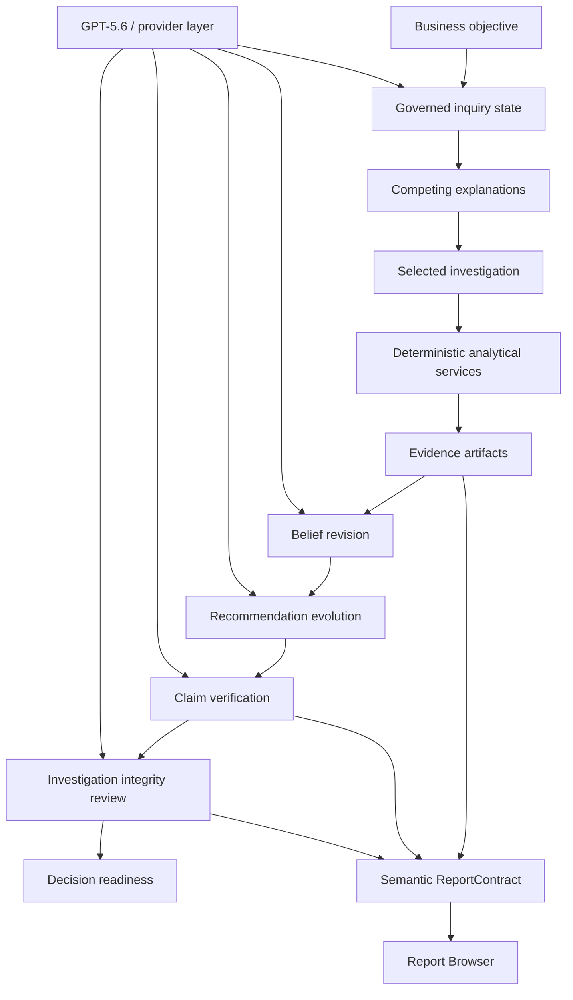

# Build Week Submission Package

## One-Minute Product Summary

Analytics Workstation is an evidence-governed AI investigation platform that transparently evolves its recommendations as evidence accumulates.

It helps users move from a business objective to a decision-ready recommendation by preserving the full reasoning path: uncertainty, competing explanations, deterministic evidence, belief revision, recommendation evolution, claim verification, skeptical integrity review, and decision readiness.

The product is intentionally not framed as a Shiny app, dashboard, AutoML tool, or chat interface. Shiny provides the local reactive runtime. The product experience is an analytical operating environment for governed investigations.

## Problem

Modern analytics workflows often split reasoning across dashboards, notebooks, reports, chat transcripts, model artifacts, and undocumented analyst judgment. This makes it hard to answer basic trust questions:

- Why did we reach this conclusion?
- What evidence supports it?
- What evidence weakens it?
- What assumptions are we carrying?
- Did the recommendation change as evidence changed?
- Is this ready for action?

LLMs intensify this problem when they produce persuasive summaries without durable evidence structure.

## Solution

Analytics Workstation treats analytical work as a governed investigation. It preserves evidence and reasoning state as first-class objects, then lets AI operate inside explicit contracts rather than as a free-form answer generator.

In the Build Week demo, the workstation investigates a synthetic enrollment-growth mystery. It compares explanations, collects deterministic evidence, revises its belief, evolves the recommendation, verifies the final claim, and performs an integrity review before declaring decision readiness.

## Why GPT-5.6

GPT-5.6 is used where probabilistic synthesis is valuable:

- framing the investigation;
- synthesizing evidence across artifacts;
- explaining belief changes;
- producing recommendation narrative;
- verifying claims against evidence;
- expressing integrity-review conclusions in human-readable language.

GPT-5.6 is not used to replace deterministic analytics. EDA, regression, SHAP, validation, report-contract construction, replay, and QA remain deterministic services.

## Why Codex

Codex accelerated the project by implementing repeated architecture and product phases while maintaining testable contracts. Its role included:

- building provider-agnostic GenAI services;
- implementing governed agent sessions;
- adding inquiry state, belief revision, claim verification, and integrity review;
- creating deterministic QA suites;
- refining the UI toward a coherent workstation;
- generating and maintaining architecture documentation.

The architectural direction remained intentional: deterministic computation first, probabilistic reasoning only where ambiguity and synthesis justify it.

## Architecture Diagram

## Demo Deliverables

Primary demo path:

1. Open Analytics Workstation.
2. Navigate to `More -> Build Week Demo`.
3. Run preflight.
4. Launch the governed investigation.
5. Show the inquiry timeline.
6. Show belief revision and recommendation evolution.
7. Click `Why should I believe this?`.
8. Show the integrity review and decision readiness.
9. Open the Report Browser.
10. Close with the evidence-governed investigation loop.

Supporting files:

- `docs/demo_script_3_minute.md`
- `docs/judge_faq.md`
- `docs/final_demo_reliability_checklist.md`
- `docs/build_week_demo_guide.md`

## Suggested Submission Text

Analytics Workstation is an evidence-governed AI investigation platform. Instead of using AI to generate a one-shot answer, it conducts a transparent investigation: it records uncertainty, compares competing explanations, gathers deterministic evidence, revises beliefs, evolves recommendations, verifies claims, and performs a skeptical integrity review before asking the user to trust the conclusion.

The Build Week demo uses a deterministic synthetic dataset with hidden mechanisms. GPT-5.6 helps frame, synthesize, explain, verify, and review the investigation, while deterministic services compute EDA, regression, SHAP evidence, validation, replay, and report contracts. The result is a governed analytical workflow where every recommendation can be traced back to evidence and challenged before action.

## Screenshot Checklist

Capture:

- branded home shell;
- Build Week Demo before launch;
- preflight checks;
- completed inquiry timeline;
- belief revision;
- recommendation evolution;
- `Why should I believe this?`;
- Investigation Integrity Review;
- Decision Readiness;
- Report Browser.

## Final Positioning Sentence

Analytics Workstation does not just produce answers. It conducts transparent, governed investigations that can revise their conclusions as evidence accumulates, then critique their own recommendations before asking for trust.
